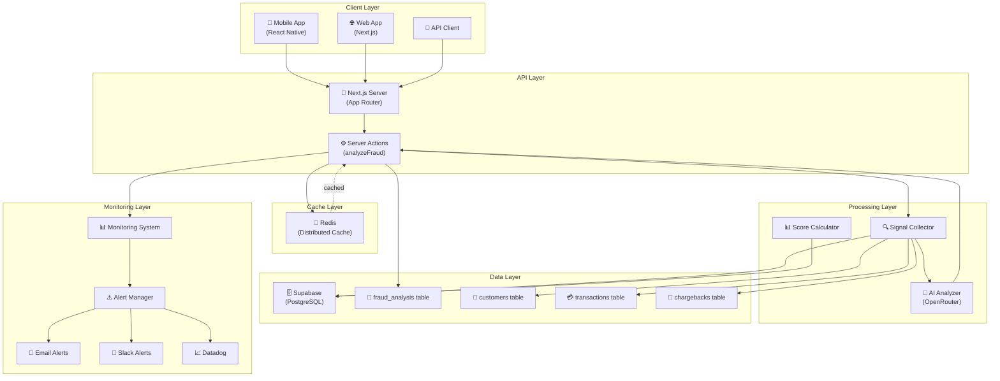
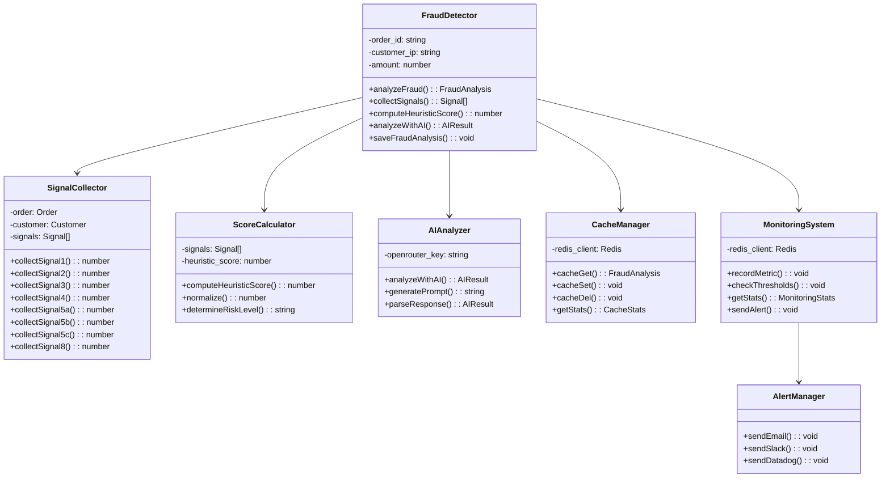
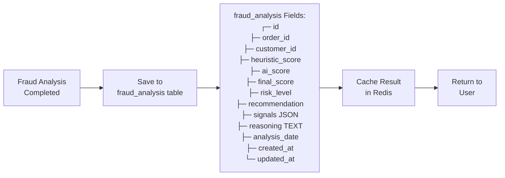

# 🏗️ Architecture Détaillée: Détection de Fraude v2

## Vue d'Ensemble du Système



---

## Flux de Données Détaillé

```mermaid
graph LR
    subgraph "INPUT"
        A["User Request<br/>{order_id,<br/>customer_ip,<br/>amount}"]
    end
    
    subgraph "CACHE LAYER"
        B["Redis Check"]
        B1["Cache Hit?"]
    end
    
    subgraph "DATA COLLECTION"
        C["Fetch Order"]
        D["Fetch Customer"]
        E["Fetch IP Rep"]
    end
    
    subgraph "SIGNAL PROCESSING"
        F["Signal 1-8"]
        G["Weight & Score"]
    end
    
    subgraph "SCORING"
        H["Heuristic Score"]
        I["Is Suspicious?"]
    end
    
    subgraph "AI LAYER"
        J["OpenRouter"]
        K["AI Analysis"]
        L["Combine Scores"]
    end
    
    subgraph "DECISION"
        M["Risk Level"]
        N["Recommendation"]
    end
    
    subgraph "PERSISTENCE"
        O["Save to DB"]
        P["Cache Result"]
    end
    
    subgraph "MONITORING"
        Q["Record Metrics"]
        R["Check Thresholds"]
    end
    
    subgraph "ALERTS"
        S["Trigger Alert?"]
        T["Send Notifications"]
    end
    
    subgraph "OUTPUT"
        U["API Response"]
    end
    
    A --> B
    B --> B1
    B1 -->|HIT| P
    B1 -->|MISS| C
    C --> D
    D --> E
    E --> F
    F --> G
    G --> H
    H --> I
    I -->|Score≥40| J
    I -->|Score<40| M
    J --> K
    K --> L
    L --> M
    M --> N
    N --> O
    O --> P
    P --> Q
    Q --> R
    R --> S
    S -->|YES| T
    S -->|NO| U
    T --> U
```



---

## Architecture en Couches

```
┌─────────────────────────────────────────────────────────────┐
│                    CLIENT LAYER                              │
│  ┌──────────────┬──────────────┬──────────────┐              │
│  │ Mobile App   │ Web App      │ API Client   │              │
│  │ (React)      │ (Next.js)    │ (SDK)        │              │
│  └──────────────┴──────────────┴──────────────┘              │
└─────────────────────────────────────────────────────────────┘
                            ↓
┌─────────────────────────────────────────────────────────────┐
│                    API LAYER                                 │
│  ┌────────────────────────────────────────┐                 │
│  │ POST /api/analyze-fraud                │                 │
│  │ ├─ Server Action: analyzeFraud()       │                 │
│  │ └─ 'use server' directive              │                 │
│  └────────────────────────────────────────┘                 │
└─────────────────────────────────────────────────────────────┘
                            ↓
┌─────────────────────────────────────────────────────────────┐
│                  CACHE LAYER                                 │
│  ┌────────────────────────────────────────┐                 │
│  │ Redis (Distributed Cache)              │                 │
│  │ ├─ TTL: 3600 seconds                   │                 │
│  │ ├─ Key: fraud:{order_id}               │                 │
│  │ ├─ Hit Rate: 50%+ in production        │                 │
│  │ └─ Latency: 23µs                       │                 │
│  └────────────────────────────────────────┘                 │
└─────────────────────────────────────────────────────────────┘
                            ↓
┌─────────────────────────────────────────────────────────────┐
│                PROCESSING LAYER                              │
│  ┌────────────────────────────────────────┐                 │
│  │ Signal Collector                       │                 │
│  │ ├─ Signal 1-8: 8 heuristics            │                 │
│  │ ├─ Data aggregation                    │                 │
│  │ └─ Weight normalization                │                 │
│  └────────────────────────────────────────┘                 │
│  ┌────────────────────────────────────────┐                 │
│  │ Score Calculator                       │                 │
│  │ ├─ Heuristic: 0-100                    │                 │
│  │ ├─ Decision tree                       │                 │
│  │ └─ Risk determination                  │                 │
│  └────────────────────────────────────────┘                 │
│  ┌────────────────────────────────────────┐                 │
│  │ AI Analyzer (OpenRouter)               │                 │
│  │ ├─ Request: signals + context          │                 │
│  │ ├─ Response: reasoning + score         │                 │
│  │ └─ Latency: 80-100ms                   │                 │
│  └────────────────────────────────────────┘                 │
└─────────────────────────────────────────────────────────────┘
                            ↓
┌─────────────────────────────────────────────────────────────┐
│                   DATA LAYER                                 │
│  ┌────────────────────────────────────────┐                 │
│  │ Supabase PostgreSQL                    │                 │
│  │ ├─ fraud_analysis table                │                 │
│  │ ├─ customers table                     │                 │
│  │ ├─ transactions table                  │                 │
│  │ ├─ chargebacks table                   │                 │
│  │ └─ ip_reputation table                 │                 │
│  └────────────────────────────────────────┘                 │
└─────────────────────────────────────────────────────────────┘
                            ↓
┌─────────────────────────────────────────────────────────────┐
│                MONITORING LAYER                              │
│  ┌────────────────────────────────────────┐                 │
│  │ Monitoring System                      │                 │
│  │ ├─ recordMetric()                      │                 │
│  │ ├─ checkThresholds()                   │                 │
│  │ ├─ getStats()                          │                 │
│  │ └─ Metrics: fraud_score, latency, etc  │                 │
│  └────────────────────────────────────────┘                 │
│  ┌────────────────────────────────────────┐                 │
│  │ Alert Manager                          │                 │
│  │ ├─ Email alerts                        │                 │
│  │ ├─ Slack notifications                 │                 │
│  │ └─ Datadog events                      │                 │
│  └────────────────────────────────────────┘                 │
└─────────────────────────────────────────────────────────────┘
```

---

## Composants Principaux



---

## Processus de Scoring

```
┌─────────────────────────────────────┐
│      HEURISTIC SCORE PHASE          │
└─────────────────────────────────────┘
       ↓
┌─────────────────────────────────────┐
│    Collect 8 Signals (Raw Data)     │
│ ├─ Signal 1: Amount check           │
│ ├─ Signal 2: Velocity check         │
│ ├─ Signal 3: Geography check        │
│ ├─ Signal 4: Account age check      │
│ ├─ Signal 5a: CVV check             │
│ ├─ Signal 5b: Chargebacks check     │
│ ├─ Signal 5c: VPN/Proxy check       │
│ └─ Signal 8: Customer history       │
└─────────────────────────────────────┘
       ↓
┌─────────────────────────────────────┐
│  Assign Weights (0-100 range)       │
│ ├─ S1: 0-35 points                  │
│ ├─ S2: 0-35 points                  │
│ ├─ S3: 0-20 points                  │
│ ├─ S4: 0-25 points                  │
│ ├─ S5a: 0-30 points                 │
│ ├─ S5b: 0-40 points                 │
│ ├─ S5c: 0-15 points                 │
│ └─ S8: -15 points                   │
└─────────────────────────────────────┘
       ↓
┌─────────────────────────────────────┐
│   Compute Heuristic Score           │
│   Score = Σ(Signal_i * Weight_i)    │
│   Result: 0-100                     │
└─────────────────────────────────────┘
       ↓
┌─────────────────────────────────────┐
│    DECISION GATE: Score ≥ 40?       │
└─────────────────────────────────────┘
       ↙              ↘
    YES              NO
     ↓                ↓
  AI PHASE        FINAL SCORE
     ↓
┌─────────────────────────────────────┐
│   AI ANALYSIS PHASE (OpenRouter)    │
│ ├─ Send signals to LLM              │
│ ├─ Request pattern analysis         │
│ ├─ Get AI confidence score          │
│ └─ Get reasoning explanation        │
└─────────────────────────────────────┘
     ↓
┌─────────────────────────────────────┐
│   SCORE COMBINATION                 │
│ Final = (Heur*0.6) + (AI*0.4)       │
│ Result: 0-100                       │
└─────────────────────────────────────┘
     ↓
┌─────────────────────────────────────┐
│   DETERMINE RISK LEVEL              │
│ ├─ Score ≥ 60: HIGH → REJECT        │
│ ├─ 40-60: MEDIUM → REVIEW           │
│ └─ < 40: LOW → APPROVE              │
└─────────────────────────────────────┘
```

---

## État de Sauvegarde en Base de Données



---

## Points Critiques du Système

```
┌──────────────────────────────────────────────┐
│         CRITICAL PERFORMANCE POINTS          │
├──────────────────────────────────────────────┤
│ 1. Cache Layer                               │
│    └─ Must have < 50µs latency               │
│    └─ Hit rate goal: 50%+ in production      │
├──────────────────────────────────────────────┤
│ 2. Signal Collection                         │
│    └─ Database queries < 10ms total          │
│    └─ 8 signals must be complete             │
├──────────────────────────────────────────────┤
│ 3. Scoring Algorithm                         │
│    └─ Must normalize to 0-100 range          │
│    └─ No score > 100 or < 0                  │
├──────────────────────────────────────────────┤
│ 4. AI Integration                            │
│    └─ Fallback if timeout > 150ms            │
│    └─ Must not block main thread             │
├──────────────────────────────────────────────┤
│ 5. Alerting System                           │
│    └─ Must trigger within 1 second           │
│    └─ No false positives > 5%                │
├──────────────────────────────────────────────┤
│ 6. Data Persistence                          │
│    └─ All results saved to DB                │
│    └─ No lost data in any case               │
└──────────────────────────────────────────────┘
```

---

## Intégration avec le Système Global

```
┌─────────────────────────────────────────────────────────────┐
│                  APPLICATION GLOBAL                         │
├─────────────────────────────────────────────────────────────┤
│                                                              │
│  ┌───────────────────┐  ┌───────────────────┐               │
│  │   Fraude Detect   │  │  Search Engine    │               │
│  │   (v2 improved)   │  │  (avec Redis)     │               │
│  └────────┬──────────┘  └────────┬──────────┘               │
│           │                       │                         │
│           └───────────┬───────────┘                         │
│                       │                                     │
│           ┌───────────▼────────────┐                        │
│           │  Monitoring System     │                        │
│           │  (Metrics + Alerts)    │                        │
│           └───────────┬────────────┘                        │
│                       │                                     │
│     ┌─────────────────┼─────────────────┐                  │
│     │                 │                 │                  │
│  ┌──▼──┐          ┌───▼───┐        ┌────▼───┐             │
│  │Email│          │Slack  │        │Datadog │             │
│  └─────┘          └───────┘        └────────┘             │
│                                                              │
└─────────────────────────────────────────────────────────────┘
```

---

**Généré**: 01 Juin 2026  
**Version**: 2.0 (Production)  
**Status**: ✅ ARCHITECTURE COMPLETE

