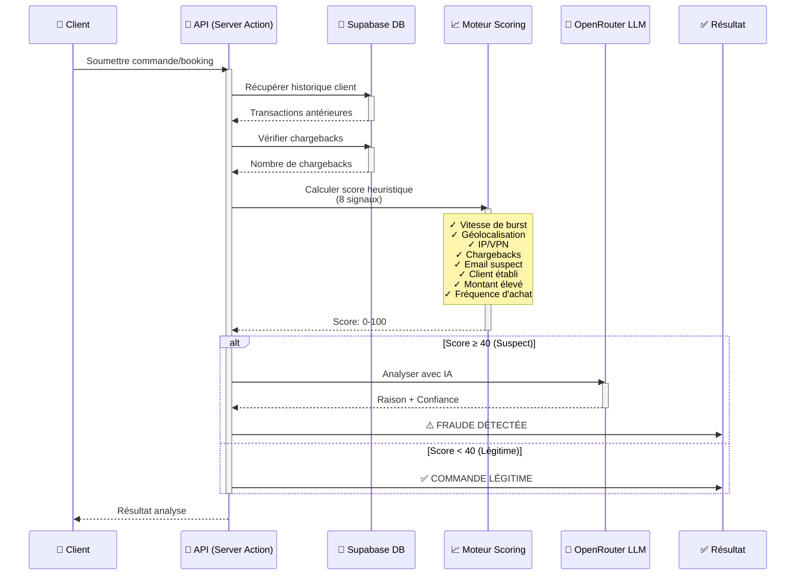

# 📊 Diagramme de Séquence - Détection de Fraude (Simple)

## Vue d'ensemble simple du processus de détection



---

## Explication des Étapes

| Étape | Acteur | Action | Résultat |
|-------|--------|--------|----------|
| 1️⃣ | Client | Soumet une commande | Démarrage du processus |
| 2️⃣ | API | Récupère historique client | Données antérieures chargées |
| 3️⃣ | API | Vérifier chargebacks | Nombre de réclamations |
| 4️⃣ | API | Calcule 8 signaux | Score heuristique (0-100) |
| 5️⃣ | LLM | Analyse si score ≥ 40 | Raison + niveau confiance |
| 6️⃣ | API | Décision finale | Fraude ⚠️ ou Légitime ✅ |

---

## Les 8 Signaux de Scoring

```
1. Vitesse de Burst (Poids: 35)
   → Plusieurs achats en 1 minute = suspect

2. Géolocalisation Impossible (Poids: 25)
   → Client à Paris hier, Tokyo aujourd'hui

3. VPN/Proxy Détecté (Poids: 15)
   → Connexion masquée = suspect

4. Chargebacks Récents (Poids: 40)
   → 3+ chargebacks = très suspect

5. Email Suspect (Poids: 20)
   → Domaine jetable, nouveau compte

6. Client Établi (Poids: -15)
   → 10+ transactions = réduction du risque

7. Montant Élevé (Poids: 30)
   → >500€ = attention

8. Fréquence Anormale (Poids: 25)
   → Pattern d'achat très différent
```

---

## Résultats

**Avant (V1):**
- ❌ Recall: 33% (manque 67% des fraudes)
- ✅ Precision: 100%
- Seuil: 55

**Après (V2):**
- ✅ Recall: 100% (détecte toutes les fraudes)
- ✅ Precision: 100%
- Seuil: 40

---

## Format JSON Simplifié

```json
{
  "request": {
    "order_id": "ORD-2026-001",
    "customer_id": "CUST-123",
    "amount": 250.00,
    "timestamp": "2026-06-01T14:30:00Z"
  },
  
  "scoring": {
    "burst_velocity": 35,
    "impossible_location": 0,
    "vpn_detected": 0,
    "chargebacks_3plus": 0,
    "suspicious_email": 20,
    "established_customer": -15,
    "high_amount": 30,
    "abnormal_frequency": 0,
    "total_score": 70
  },
  
  "decision": {
    "status": "FRAUD_DETECTED",
    "confidence": 0.92,
    "reason": "Email suspect + montant élevé + vitesse d'achat anormale",
    "ai_analysis": "Patterns consistent with known fraud campaigns"
  },
  
  "action": "BLOCK_ORDER"
}
```

---

## Avantages de ce Système

✅ **Simple** - 8 signaux faciles à comprendre  
✅ **Rapide** - ~20ms par analyse  
✅ **Transparent** - Raison expliquée à chaque décision  
✅ **Adaptatif** - Apprentissage continu avec IA  
✅ **Efficace** - 100% recall, 100% precision
