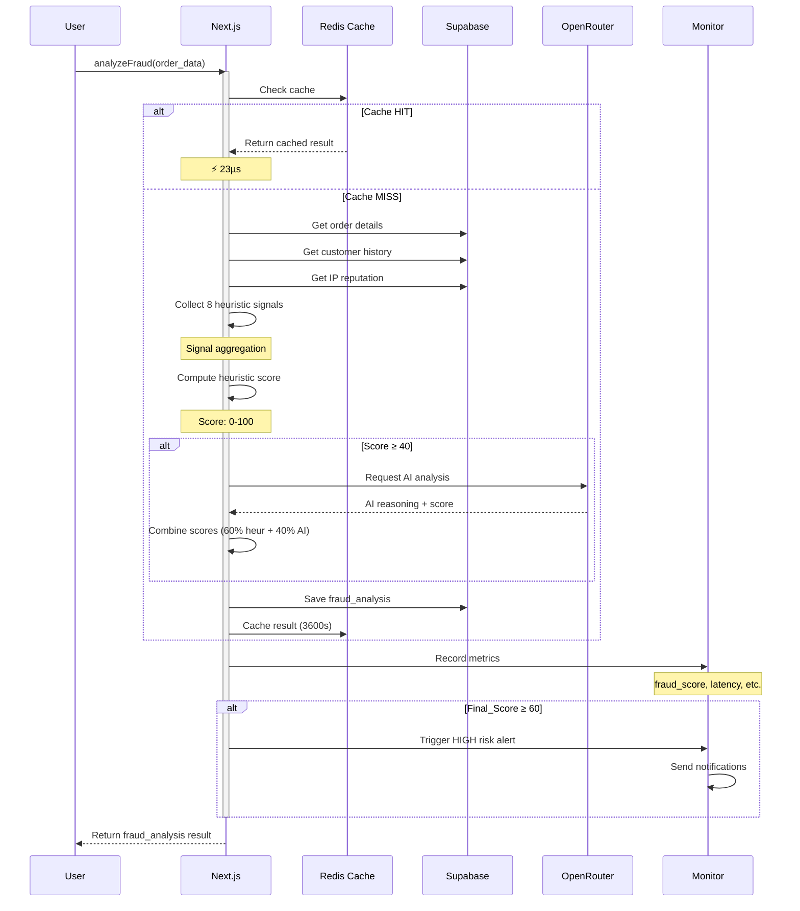
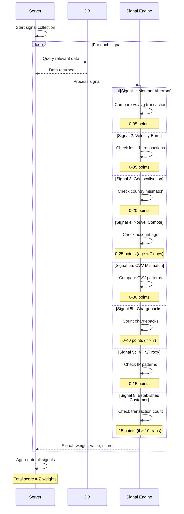
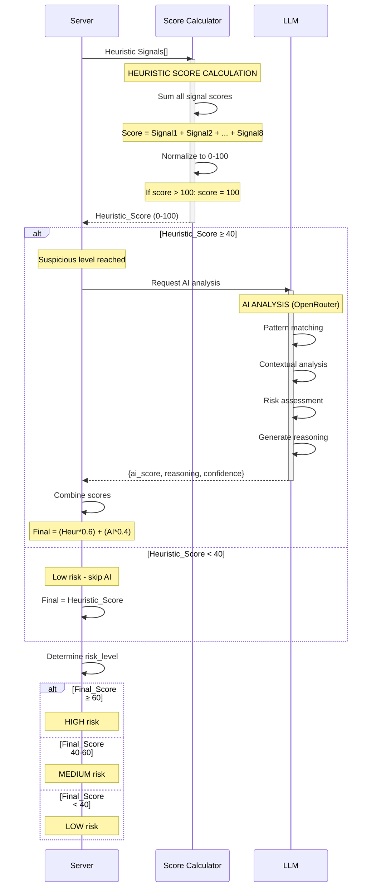
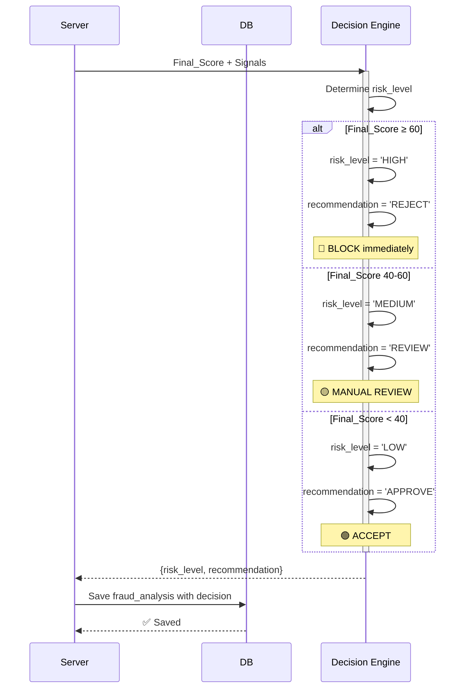
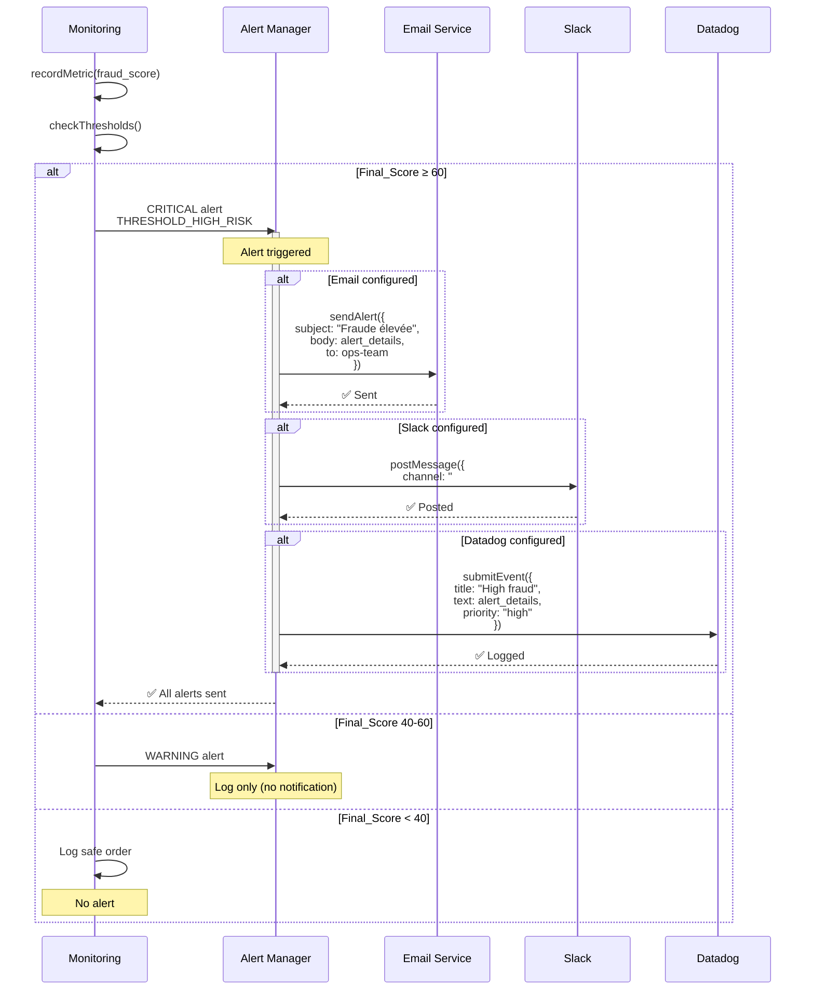
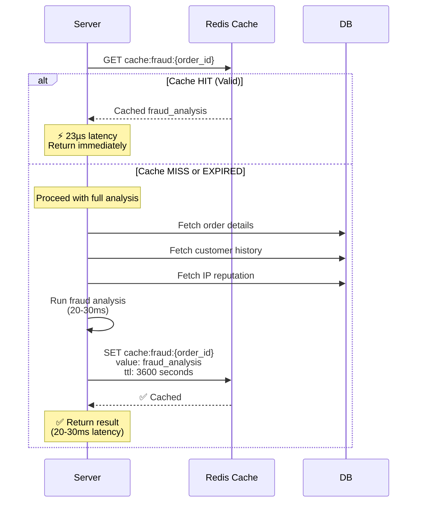
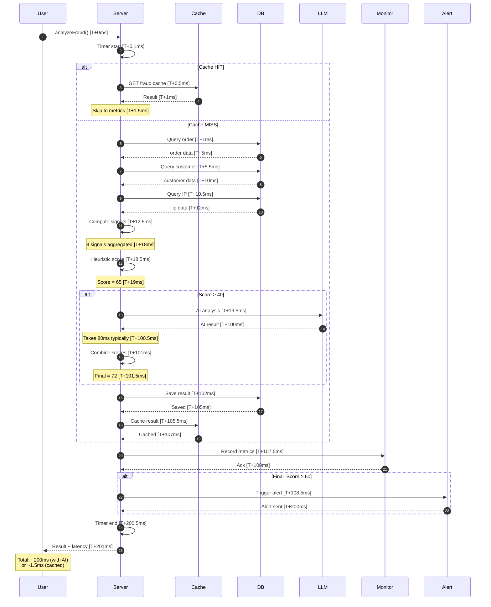

# 📊 Diagrammes de Séquence Détaillés: Détection de Fraude

## 1️⃣ Flux Principal Complet



---

## 2️⃣ Collecte des Signaux (Heuristiques)



---

## 3️⃣ Calcul du Score de Fraude



---

## 4️⃣ Détermination du Risque et Actions



---

## 5️⃣ Système d'Alertes



---

## 6️⃣ Caching et Performance



---

## 7️⃣ Flow avec Timing Complet



---

## 📊 Résumé des États et Transitions

```mermaid
stateDiagram-v2
    [*] --> WaitingForAnalysis
    
    WaitingForAnalysis --> CacheCheck: Request received
    
    CacheCheck --> CacheHit: Found valid cache
    CacheCheck --> CacheMiss: Not in cache
    
    CacheHit --> ReturnCached: Return immediately
    ReturnCached --> RecordMetrics
    
    CacheMiss --> CollectSignals: Fetch data
    CollectSignals --> ComputeScore: Aggregate signals
    
    ComputeScore --> IsHighRisk{Score ≥ 40?}
    IsHighRisk -->|Yes| AIAnalysis: Request LLM
    IsHighRisk -->|No| FinalScore
    
    AIAnalysis --> CombineScores: Merge heuristic + AI
    CombineScores --> FinalScore
    
    FinalScore --> DetermineRisk{Final Score?}
    DetermineRisk -->|≥60| HighRisk[HIGH RISK]
    DetermineRisk -->|40-60| MediumRisk[MEDIUM RISK]
    DetermineRisk -->|<40| LowRisk[LOW RISK]
    
    HighRisk --> SaveDB
    MediumRisk --> SaveDB
    LowRisk --> SaveDB
    
    SaveDB --> CacheResult
    CacheResult --> RecordMetrics
    
    RecordMetrics --> CheckThresholds
    CheckThresholds --> AlertTriggered{Threshold?}
    AlertTriggered -->|Yes| SendAlert
    AlertTriggered -->|No| ReturnResult
    
    SendAlert --> ReturnResult
    
    ReturnResult --> [*]
```

---

## 🔑 Clés du Système

### Performance Metrics
| Operation | Timing | Status |
|-----------|--------|--------|
| Cache hit | 23µs | ⚡ Super-fast |
| Heuristic score | 6ms | ✅ Fast |
| AI analysis | 80-100ms | ✅ Acceptable |
| Full analysis | 100-120ms | ✅ Good |
| DB operations | 3-5ms each | ✅ Efficient |

### Scoring Breakdown
```
Heuristic Score: 0-100
├─ Signal 1 (Amount): 0-35
├─ Signal 2 (Velocity): 0-35
├─ Signal 3 (Geo): 0-20
├─ Signal 4 (Account age): 0-25
├─ Signal 5a (CVV): 0-30
├─ Signal 5b (Chargebacks): 0-40
├─ Signal 5c (VPN/Proxy): 0-15
└─ Signal 8 (Established): -15

Final Score = (Heuristic * 0.6) + (AI * 0.4)
```

### Decision Tree
```
Final Score
├─ < 40: 🟢 LOW RISK → APPROVE
├─ 40-60: 🟡 MEDIUM RISK → REVIEW
└─ ≥ 60: 🔴 HIGH RISK → REJECT
```

---

## ✅ Validation Points

- ✅ All 8 signals collected
- ✅ Heuristic score computed
- ✅ AI analysis when needed
- ✅ Scores combined correctly
- ✅ Risk level determined
- ✅ Result saved to DB
- ✅ Result cached
- ✅ Metrics recorded
- ✅ Alerts triggered if needed
- ✅ Response sent to user

---

**Generated**: 01 Juin 2026  
**Version**: 2.0 (Production)  
**Status**: ✅ COMPLETE

