# 📊 Diagrammes de Séquence - Interfaces Utilisateur Ro2ya

**Document:** Diagrammes de Séquence Détaillés des Interfaces  
**Date:** 2 juin 2026  
**Audience:** PFE - Architecture Complète Ro2ya  

---

## 📑 Table des Matières

1. [Interface Client](#1-interface-client)
2. [Espace Commerçant](#2-espace-commerçant)
3. [Plateforme Administrateur](#3-plateforme-administrateur)
4. [Intégration et Interfaçage](#4-intégration-et-interfaçage)

---

## 1. Interface Client

### 1.1 Authentification (Login/Register)

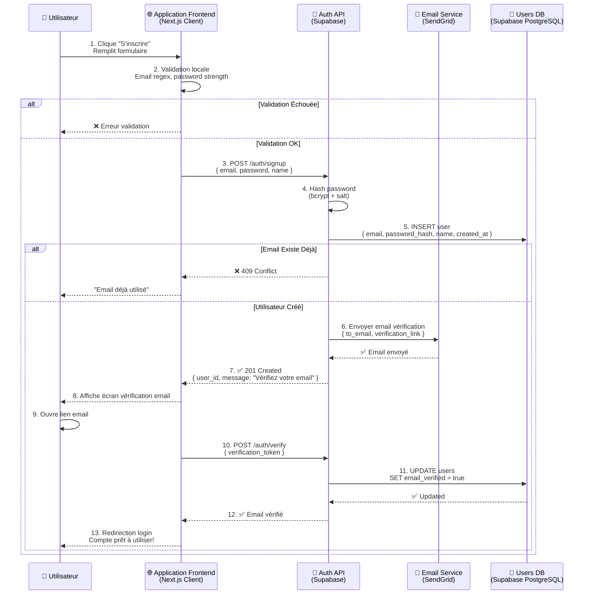
```mermaid
sequenceDiagram
    participant User as 👤 Utilisateur
    participant FrontendApp as 🌐 Application Frontend<br/>(Next.js Client)
    participant AuthAPI as 🔐 Auth API<br/>(Supabase)
    participant EmailService as 📧 Email Service<br/>(SendGrid)
    participant Database as 💾 Users DB<br/>(Supabase PostgreSQL)

    User->>FrontendApp: 1. Clique "S'inscrire"<br/>Remplit formulaire
    FrontendApp->>FrontendApp: 2. Validation locale<br/>Email regex, password strength
    
    alt Validation Échouée
        FrontendApp-->>User: ❌ Erreur validation
    else Validation OK
        FrontendApp->>AuthAPI: 3. POST /auth/signup<br/>{ email, password, name }
        
        AuthAPI->>AuthAPI: 4. Hash password<br/>(bcrypt + salt)
        AuthAPI->>Database: 5. INSERT user<br/>{ email, password_hash, name, created_at }
        
        alt Email Existe Déjà
            AuthAPI-->>FrontendApp: ❌ 409 Conflict
            FrontendApp-->>User: "Email déjà utilisé"
        else Utilisateur Créé
            AuthAPI->>EmailService: 6. Envoyer email vérification<br/>{ to_email, verification_link }
            EmailService-->>AuthAPI: ✅ Email envoyé
            
            AuthAPI-->>FrontendApp: 7. ✅ 201 Created<br/>{ user_id, message: "Vérifiez votre email" }
            FrontendApp-->>User: 8. Affiche écran vérification email
            
            User->>User: 9. Ouvre lien email
            FrontendApp->>AuthAPI: 10. POST /auth/verify<br/>{ verification_token }
            
            AuthAPI->>Database: 11. UPDATE users<br/>SET email_verified = true
            Database-->>AuthAPI: ✅ Updated
            
            AuthAPI-->>FrontendApp: 12. ✅ Email vérifié
            FrontendApp-->>User: 13. Redirection login<br/>Compte prêt à utiliser!
        end
    end
```

### 1.2 Flux Recherche Sémantique

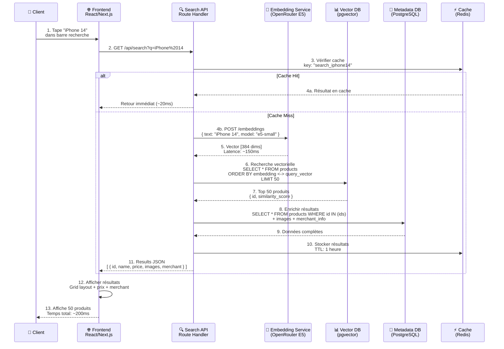
```mermaid
sequenceDiagram
    participant User as 👤 Client
    participant FrontendApp as 🌐 Frontend<br/>React/Next.js
    participant SearchAPI as 🔍 Search API<br/>Route Handler
    participant EmbeddingService as 🧠 Embedding Service<br/>(OpenRouter E5)
    participant VectorDB as 📊 Vector DB<br/>(pgvector)
    participant MetadataDB as 💾 Metadata DB<br/>(PostgreSQL)
    participant Cache as ⚡ Cache<br/>(Redis)

    User->>FrontendApp: 1. Tape "iPhone 14"<br/>dans barre recherche
    FrontendApp->>SearchAPI: 2. GET /api/search?q=iPhone%2014
    
    SearchAPI->>Cache: 3. Vérifier cache<br/>key: "search_iphone14"
    
    alt Cache Hit
        Cache-->>SearchAPI: 4a. Résultat en cache
        SearchAPI-->>FrontendApp: Retour immédiat (~20ms)
    else Cache Miss
        SearchAPI->>EmbeddingService: 4b. POST /embeddings<br/>{ text: "iPhone 14", model: "e5-small" }
        EmbeddingService-->>SearchAPI: 5. Vector [384 dims]<br/>Latence: ~150ms
        
        SearchAPI->>VectorDB: 6. Recherche vectorielle<br/>SELECT * FROM products<br/>ORDER BY embedding <-> query_vector<br/>LIMIT 50
        
        VectorDB-->>SearchAPI: 7. Top 50 produits<br/>{ id, similarity_score }
        
        SearchAPI->>MetadataDB: 8. Enrichir résultats<br/>SELECT * FROM products WHERE id IN (ids)<br/>+ images + merchant_info
        
        MetadataDB-->>SearchAPI: 9. Données complètes
        
        SearchAPI->>Cache: 10. Stocker résultats<br/>TTL: 1 heure
        
        SearchAPI-->>FrontendApp: 11. Results JSON<br/>[ { id, name, price, images, merchant } ]
    end
    
    FrontendApp->>FrontendApp: 12. Afficher résultats<br/>Grid layout + prix + merchant
    FrontendApp-->>User: 13. Affiche 50 produits<br/>Temps total: ~200ms
```

### 1.3 Flux Commande Complète

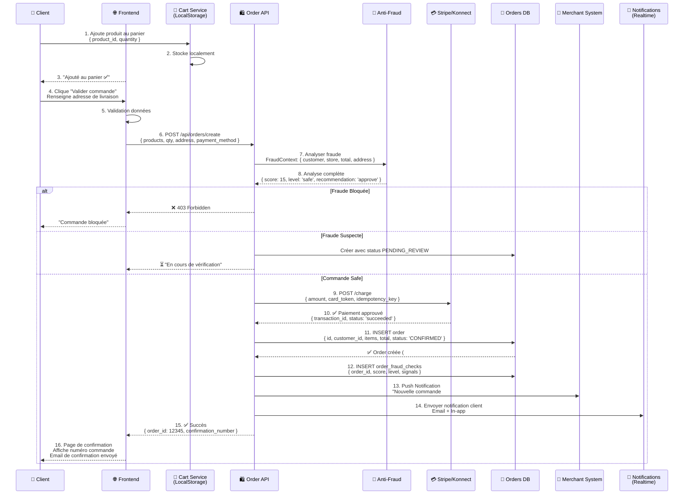
```mermaid
sequenceDiagram
    participant User as 👤 Client
    participant FrontendApp as 🌐 Frontend
    participant CartService as 🛒 Cart Service<br/>(LocalStorage)
    participant OrderAPI as 🛍️ Order API
    participant FraudDetection as 🔐 Anti-Fraud
    participant PaymentGateway as 💳 Stripe/Konnect
    participant OrderDB as 💾 Orders DB
    participant Merchant as 🏪 Merchant System
    participant Notification as 🔔 Notifications<br/>(Realtime)

    User->>CartService: 1. Ajoute produit au panier<br/>{ product_id, quantity }
    CartService->>CartService: 2. Stocke localement
    FrontendApp-->>User: 3. "Ajouté au panier ✅"

    User->>FrontendApp: 4. Clique "Valider commande"<br/>Renseigne adresse de livraison
    FrontendApp->>FrontendApp: 5. Validation données
    
    FrontendApp->>OrderAPI: 6. POST /api/orders/create<br/>{ products, qty, address, payment_method }
    
    OrderAPI->>FraudDetection: 7. Analyser fraude<br/>FraudContext: { customer, store, total, address }
    FraudDetection-->>OrderAPI: 8. Analyse complète<br/>{ score: 15, level: 'safe', recommendation: 'approve' }
    
    alt Fraude Bloquée
        OrderAPI-->>FrontendApp: ❌ 403 Forbidden
        FrontendApp-->>User: "Commande bloquée"
    else Fraude Suspecte
        OrderAPI->>OrderDB: Créer avec status PENDING_REVIEW
        OrderAPI-->>FrontendApp: ⏳ "En cours de vérification"
    else Commande Safe
        OrderAPI->>PaymentGateway: 9. POST /charge<br/>{ amount, card_token, idempotency_key }
        PaymentGateway-->>OrderAPI: 10. ✅ Paiement approuvé<br/>{ transaction_id, status: 'succeeded' }
        
        OrderAPI->>OrderDB: 11. INSERT order<br/>{ id, customer_id, items, total, status: 'CONFIRMED' }
        OrderDB-->>OrderAPI: ✅ Order créée (#12345)
        
        OrderAPI->>OrderDB: 12. INSERT order_fraud_checks<br/>{ order_id, score, level, signals }
        
        OrderAPI->>Merchant: 13. Push Notification<br/>"Nouvelle commande #12345"<br/>(via WebSocket)
        
        OrderAPI->>Notification: 14. Envoyer notification client<br/>Email + In-app
        
        OrderAPI-->>FrontendApp: 15. ✅ Succès<br/>{ order_id: 12345, confirmation_number }
        
        FrontendApp-->>User: 16. Page de confirmation<br/>Affiche numéro commande<br/>Email de confirmation envoyé
    end
```

### 1.4 Flux Réservation (Booking)

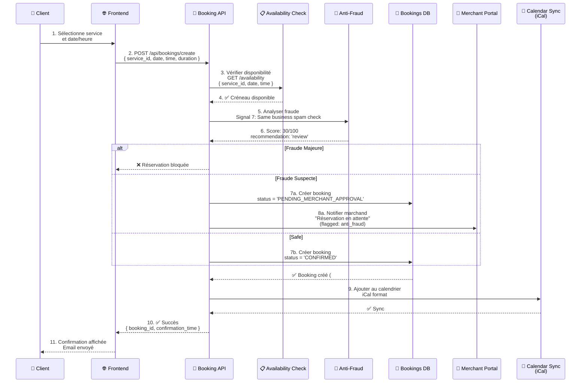
```mermaid
sequenceDiagram
    participant User as 👤 Client
    participant FrontendApp as 🌐 Frontend
    participant BookingAPI as 📅 Booking API
    participant AvailabilityService as 📋 Availability Check
    participant FraudDetection as 🔐 Anti-Fraud
    participant BookingDB as 💾 Bookings DB
    participant Merchant as 🏪 Merchant Portal
    participant Calendar as 📅 Calendar Sync<br/>(iCal)

    User->>FrontendApp: 1. Sélectionne service<br/>et date/heure
    FrontendApp->>BookingAPI: 2. POST /api/bookings/create<br/>{ service_id, date, time, duration }
    
    BookingAPI->>AvailabilityService: 3. Vérifier disponibilité<br/>GET /availability<br/>{ service_id, date, time }
    AvailabilityService-->>BookingAPI: 4. ✅ Créneau disponible
    
    BookingAPI->>FraudDetection: 5. Analyser fraude<br/>Signal 7: Same business spam check
    FraudDetection-->>BookingAPI: 6. Score: 30/100<br/>recommendation: 'review'
    
    alt Fraude Majeure
        BookingAPI-->>FrontendApp: ❌ Réservation bloquée
    else Fraude Suspecte
        BookingAPI->>BookingDB: 7a. Créer booking<br/>status = 'PENDING_MERCHANT_APPROVAL'
        BookingAPI->>Merchant: 8a. Notifier marchand<br/>"Réservation en attente"<br/>(flagged: anti_fraud)
    else Safe
        BookingAPI->>BookingDB: 7b. Créer booking<br/>status = 'CONFIRMED'
    end
    
    BookingDB-->>BookingAPI: ✅ Booking créé (#54321)
    
    BookingAPI->>Calendar: 9. Ajouter au calendrier<br/>iCal format
    Calendar-->>BookingAPI: ✅ Sync
    
    BookingAPI-->>FrontendApp: 10. ✅ Succès<br/>{ booking_id, confirmation_time }
    FrontendApp-->>User: 11. Confirmation affichée<br/>Email envoyé
```

### 1.5 Flux Messages/Messagerie Temps Réel

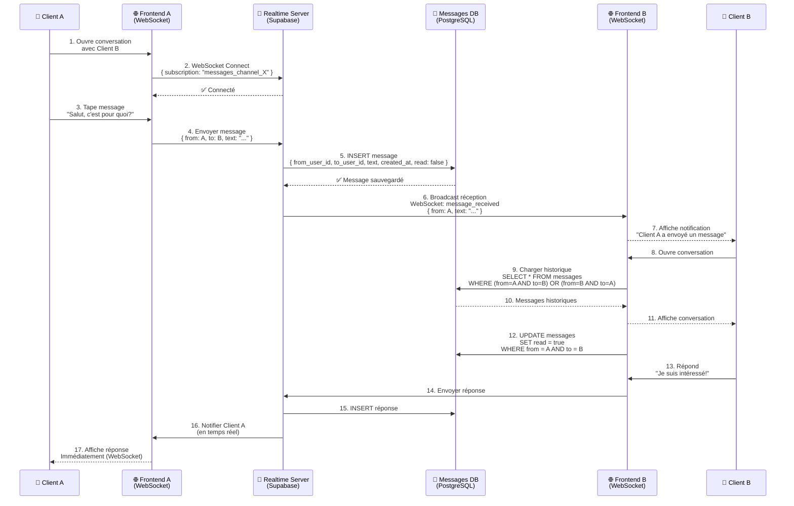
```mermaid
sequenceDiagram
    participant Client1 as 👤 Client A
    participant FrontendA as 🌐 Frontend A<br/>(WebSocket)
    participant RealtimeServer as 🔄 Realtime Server<br/>(Supabase)
    participant MessageDB as 💾 Messages DB<br/>(PostgreSQL)
    participant FrontendB as 🌐 Frontend B<br/>(WebSocket)
    participant Client2 as 👤 Client B

    Client1->>FrontendA: 1. Ouvre conversation<br/>avec Client B
    FrontendA->>RealtimeServer: 2. WebSocket Connect<br/>{ subscription: "messages_channel_X" }
    RealtimeServer-->>FrontendA: ✅ Connecté
    
    Client1->>FrontendA: 3. Tape message<br/>"Salut, c'est pour quoi?"
    FrontendA->>RealtimeServer: 4. Envoyer message<br/>{ from: A, to: B, text: "..." }
    
    RealtimeServer->>MessageDB: 5. INSERT message<br/>{ from_user_id, to_user_id, text, created_at, read: false }
    MessageDB-->>RealtimeServer: ✅ Message sauvegardé
    
    RealtimeServer->>FrontendB: 6. Broadcast réception<br/>WebSocket: message_received<br/>{ from: A, text: "..." }
    
    FrontendB-->>Client2: 7. Affiche notification<br/>"Client A a envoyé un message"
    
    Client2->>FrontendB: 8. Ouvre conversation
    FrontendB->>MessageDB: 9. Charger historique<br/>SELECT * FROM messages<br/>WHERE (from=A AND to=B) OR (from=B AND to=A)
    
    MessageDB-->>FrontendB: 10. Messages historiques
    FrontendB-->>Client2: 11. Affiche conversation
    
    FrontendB->>MessageDB: 12. UPDATE messages<br/>SET read = true<br/>WHERE from = A AND to = B
    
    Client2->>FrontendB: 13. Répond<br/>"Je suis intéressé!"
    FrontendB->>RealtimeServer: 14. Envoyer réponse
    
    RealtimeServer->>MessageDB: 15. INSERT réponse
    RealtimeServer->>FrontendA: 16. Notifier Client A<br/>(en temps réel)
    
    FrontendA-->>Client1: 17. Affiche réponse<br/>Immédiatement (WebSocket)
```

### 1.6 Flux Profil et Historique

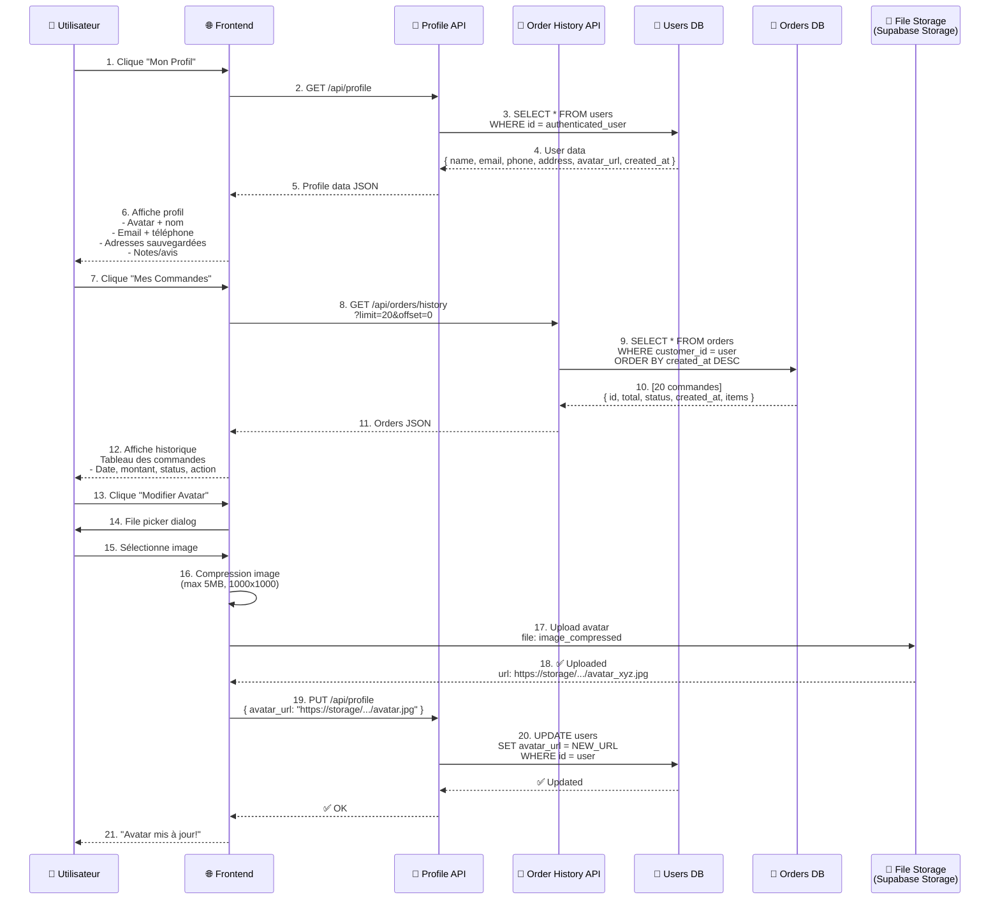
```mermaid
sequenceDiagram
    participant User as 👤 Utilisateur
    participant FrontendApp as 🌐 Frontend
    participant ProfileAPI as 👤 Profile API
    participant OrderHistoryAPI as 📜 Order History API
    participant UserDB as 💾 Users DB
    participant OrderDB as 💾 Orders DB
    participant FileStorage as 📁 File Storage<br/>(Supabase Storage)

    User->>FrontendApp: 1. Clique "Mon Profil"
    
    FrontendApp->>ProfileAPI: 2. GET /api/profile
    ProfileAPI->>UserDB: 3. SELECT * FROM users<br/>WHERE id = authenticated_user
    UserDB-->>ProfileAPI: 4. User data<br/>{ name, email, phone, address, avatar_url, created_at }
    
    ProfileAPI-->>FrontendApp: 5. Profile data JSON
    FrontendApp-->>User: 6. Affiche profil<br/>- Avatar + nom<br/>- Email + téléphone<br/>- Adresses sauvegardées<br/>- Notes/avis

    User->>FrontendApp: 7. Clique "Mes Commandes"
    FrontendApp->>OrderHistoryAPI: 8. GET /api/orders/history<br/>?limit=20&offset=0
    
    OrderHistoryAPI->>OrderDB: 9. SELECT * FROM orders<br/>WHERE customer_id = user<br/>ORDER BY created_at DESC
    OrderDB-->>OrderHistoryAPI: 10. [20 commandes]<br/>{ id, total, status, created_at, items }
    
    OrderHistoryAPI-->>FrontendApp: 11. Orders JSON
    FrontendApp-->>User: 12. Affiche historique<br/>Tableau des commandes<br/>- Date, montant, status, action

    User->>FrontendApp: 13. Clique "Modifier Avatar"
    FrontendApp->>User: 14. File picker dialog
    User->>FrontendApp: 15. Sélectionne image
    
    FrontendApp->>FrontendApp: 16. Compression image<br/>(max 5MB, 1000x1000)
    FrontendApp->>FileStorage: 17. Upload avatar<br/>file: image_compressed
    
    FileStorage-->>FrontendApp: 18. ✅ Uploaded<br/>url: https://storage/.../avatar_xyz.jpg
    
    FrontendApp->>ProfileAPI: 19. PUT /api/profile<br/>{ avatar_url: "https://storage/.../avatar.jpg" }
    
    ProfileAPI->>UserDB: 20. UPDATE users<br/>SET avatar_url = NEW_URL<br/>WHERE id = user
    
    UserDB-->>ProfileAPI: ✅ Updated
    ProfileAPI-->>FrontendApp: ✅ OK
    FrontendApp-->>User: 21. "Avatar mis à jour!"
```

---

## 2. Espace Commerçant

### 2.1 Tableau de Bord Marchand

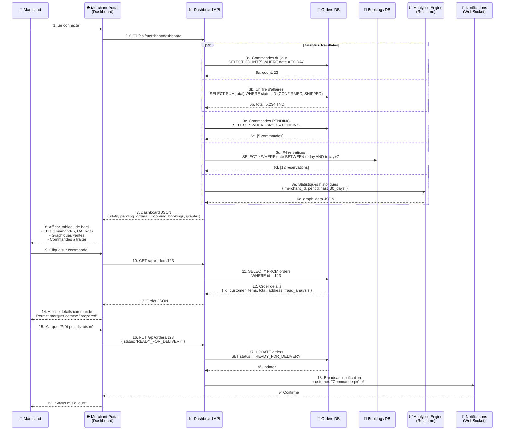
```mermaid
sequenceDiagram
    participant Merchant as 🏪 Marchand
    participant MerchantApp as 🌐 Merchant Portal<br/>(Dashboard)
    participant DashboardAPI as 📊 Dashboard API
    participant OrderDB as 💾 Orders DB
    participant BookingDB as 💾 Bookings DB
    participant AnalyticsEngine as 📈 Analytics Engine<br/>(Real-time)
    participant NotificationService as 🔔 Notifications<br/>(WebSocket)

    Merchant->>MerchantApp: 1. Se connecte
    MerchantApp->>DashboardAPI: 2. GET /api/merchant/dashboard
    
    par Analytics Parallèles
        DashboardAPI->>OrderDB: 3a. Commandes du jour<br/>SELECT COUNT(*) WHERE date = TODAY
        OrderDB-->>DashboardAPI: 6a. count: 23
    and
        DashboardAPI->>OrderDB: 3b. Chiffre d'affaires<br/>SELECT SUM(total) WHERE status IN (CONFIRMED, SHIPPED)
        OrderDB-->>DashboardAPI: 6b. total: 5,234 TND
    and
        DashboardAPI->>OrderDB: 3c. Commandes PENDING<br/>SELECT * WHERE status = PENDING
        OrderDB-->>DashboardAPI: 6c. [5 commandes]
    and
        DashboardAPI->>BookingDB: 3d. Réservations<br/>SELECT * WHERE date BETWEEN today AND today+7
        BookingDB-->>DashboardAPI: 6d. [12 réservations]
    and
        DashboardAPI->>AnalyticsEngine: 3e. Statistiques historiques<br/>{ merchant_id, period: 'last_30_days' }
        AnalyticsEngine-->>DashboardAPI: 6e. graph_data JSON
    end
    
    DashboardAPI-->>MerchantApp: 7. Dashboard JSON<br/>{ stats, pending_orders, upcoming_bookings, graphs }
    
    MerchantApp-->>Merchant: 8. Affiche tableau de bord<br/>- KPIs (commandes, CA, avis)<br/>- Graphiques ventes<br/>- Commandes à traiter
    
    Merchant->>MerchantApp: 9. Clique sur commande #123<br/>pour voir détails
    
    MerchantApp->>DashboardAPI: 10. GET /api/orders/123
    DashboardAPI->>OrderDB: 11. SELECT * FROM orders<br/>WHERE id = 123
    
    OrderDB-->>DashboardAPI: 12. Order details<br/>{ id, customer, items, total, address, fraud_analysis }
    
    DashboardAPI-->>MerchantApp: 13. Order JSON
    MerchantApp-->>Merchant: 14. Affiche détails commande<br/>Permet marquer comme "prepared"
    
    Merchant->>MerchantApp: 15. Marque "Prêt pour livraison"
    MerchantApp->>DashboardAPI: 16. PUT /api/orders/123<br/>{ status: 'READY_FOR_DELIVERY' }
    
    DashboardAPI->>OrderDB: 17. UPDATE orders<br/>SET status = 'READY_FOR_DELIVERY'
    OrderDB-->>DashboardAPI: ✅ Updated
    
    DashboardAPI->>NotificationService: 18. Broadcast notification<br/>customer: "Commande prête!"
    NotificationService-->>MerchantApp: ✅ Confirmé
    
    MerchantApp-->>Merchant: 19. "Status mis à jour!"
```

### 2.2 Gestion des Produits + IA

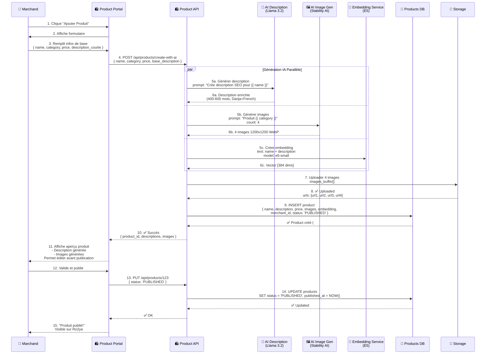
```mermaid
sequenceDiagram
    participant Merchant as 🏪 Marchand
    participant ProductPortal as 🛍️ Product Portal
    participant ProductAPI as 🛍️ Product API
    participant AIDescriptionService as 📝 AI Description<br/>(Llama 3.2)
    participant AIImageService as 🖼️ AI Image Gen<br/>(Stability AI)
    participant EmbeddingService as 🧠 Embedding Service<br/>(E5)
    participant ProductDB as 💾 Products DB
    participant FileStorage as 📁 Storage

    Merchant->>ProductPortal: 1. Clique "Ajouter Produit"
    ProductPortal->>Merchant: 2. Affiche formulaire
    
    Merchant->>ProductPortal: 3. Remplit infos de base<br/>{ name, category, price, description_courte }
    
    ProductPortal->>ProductAPI: 4. POST /api/products/create-with-ai<br/>{ name, category, price, base_description }
    
    par Génération IA Parallèle
        ProductAPI->>AIDescriptionService: 5a. Générer description<br/>prompt: "Crée description SEO pour {{ name }}"
        AIDescriptionService-->>ProductAPI: 6a. Description enrichie<br/>(400-600 mots, Darija+French)
    and
        ProductAPI->>AIImageService: 5b. Générer images<br/>prompt: "Produit {{ category }}"<br/>count: 4
        AIImageService-->>ProductAPI: 6b. 4 images 1200x1200 WebP
    and
        ProductAPI->>EmbeddingService: 5c. Créer embedding<br/>text: name + description<br/>model: e5-small
        EmbeddingService-->>ProductAPI: 6c. Vector [384 dims]
    end
    
    ProductAPI->>FileStorage: 7. Uploader 4 images<br/>images_buffer[]
    FileStorage-->>ProductAPI: 8. ✅ Uploaded<br/>urls: [url1, url2, url3, url4]
    
    ProductAPI->>ProductDB: 9. INSERT product<br/>{ name, description, price, images, embedding,<br/>merchant_id, status: 'PUBLISHED' }
    
    ProductDB-->>ProductAPI: ✅ Product créé (#prod_123)
    
    ProductAPI-->>ProductPortal: 10. ✅ Succès<br/>{ product_id, descriptions, images }
    
    ProductPortal-->>Merchant: 11. Affiche aperçu produit<br/>- Description générée<br/>- Images générées<br/>Permet éditer avant publication
    
    Merchant->>ProductPortal: 12. Valide et publie
    ProductPortal->>ProductAPI: 13. PUT /api/products/123<br/>{ status: 'PUBLISHED' }
    
    ProductAPI->>ProductDB: 14. UPDATE products<br/>SET status = 'PUBLISHED', published_at = NOW()
    
    ProductDB-->>ProductAPI: ✅ Updated
    ProductAPI-->>ProductPortal: ✅ OK
    ProductPortal-->>Merchant: 15. "Produit publié!"<br/>Visible sur Ro2ya
```

### 2.3 Gestion des Commandes en Temps Réel

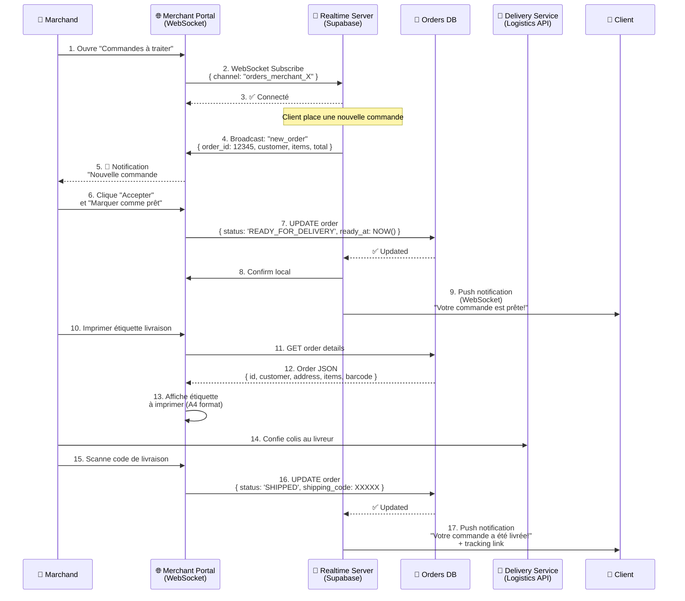
```mermaid
sequenceDiagram
    participant Merchant as 🏪 Marchand
    participant MerchantApp as 🌐 Merchant Portal<br/>(WebSocket)
    participant RealtimeServer as 🔄 Realtime Server<br/>(Supabase)
    participant OrderDB as 💾 Orders DB
    participant DeliveryService as 🚚 Delivery Service<br/>(Logistics API)
    participant Customer as 👤 Client

    Merchant->>MerchantApp: 1. Ouvre "Commandes à traiter"
    MerchantApp->>RealtimeServer: 2. WebSocket Subscribe<br/>{ channel: "orders_merchant_X" }
    
    RealtimeServer-->>MerchantApp: 3. ✅ Connecté

    Note over RealtimeServer: Client place une nouvelle commande
    
    RealtimeServer->>MerchantApp: 4. Broadcast: "new_order"<br/>{ order_id: 12345, customer, items, total }
    
    MerchantApp-->>Merchant: 5. 🔔 Notification<br/>"Nouvelle commande #12345"<br/>Affiche dans liste

    Merchant->>MerchantApp: 6. Clique "Accepter"<br/>et "Marquer comme prêt"
    
    MerchantApp->>OrderDB: 7. UPDATE order<br/>{ status: 'READY_FOR_DELIVERY', ready_at: NOW() }
    
    OrderDB-->>RealtimeServer: ✅ Updated
    
    RealtimeServer->>MerchantApp: 8. Confirm local
    RealtimeServer->>Customer: 9. Push notification<br/>(WebSocket)<br/>"Votre commande est prête!"

    Merchant->>MerchantApp: 10. Imprimer étiquette livraison
    MerchantApp->>OrderDB: 11. GET order details
    
    OrderDB-->>MerchantApp: 12. Order JSON<br/>{ id, customer, address, items, barcode }
    
    MerchantApp->>MerchantApp: 13. Affiche étiquette<br/>à imprimer (A4 format)
    
    Merchant->>DeliveryService: 14. Confie colis au livreur
    
    Merchant->>MerchantApp: 15. Scanne code de livraison
    MerchantApp->>OrderDB: 16. UPDATE order<br/>{ status: 'SHIPPED', shipping_code: XXXXX }
    
    OrderDB-->>RealtimeServer: ✅ Updated
    
    RealtimeServer->>Customer: 17. Push notification<br/>"Votre commande a été livrée!"<br/>+ tracking link
```

---

## 3. Plateforme Administrateur

### 3.1 Dashboard Administrateur

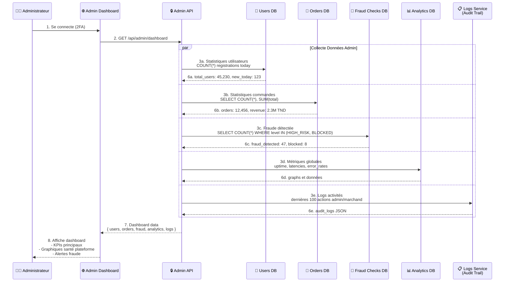
```mermaid
sequenceDiagram
    participant Admin as 👨‍💼 Administrateur
    participant AdminApp as 🌐 Admin Dashboard
    participant AdminAPI as 🔒 Admin API
    participant UserDB as 💾 Users DB
    participant OrderDB as 💾 Orders DB
    participant FraudDB as 💾 Fraud Checks DB
    participant AnalyticsDB as 📊 Analytics DB
    participant LogsService as 📋 Logs Service<br/>(Audit Trail)

    Admin->>AdminApp: 1. Se connecte (2FA)
    AdminApp->>AdminAPI: 2. GET /api/admin/dashboard
    
    par Collecte Données Admin
        AdminAPI->>UserDB: 3a. Statistiques utilisateurs<br/>COUNT(*) registrations today
        UserDB-->>AdminAPI: 6a. total_users: 45,230, new_today: 123
    and
        AdminAPI->>OrderDB: 3b. Statistiques commandes<br/>SELECT COUNT(*), SUM(total)
        OrderDB-->>AdminAPI: 6b. orders: 12,456, revenue: 2.3M TND
    and
        AdminAPI->>FraudDB: 3c. Fraude détectée<br/>SELECT COUNT(*) WHERE level IN (HIGH_RISK, BLOCKED)
        FraudDB-->>AdminAPI: 6c. fraud_detected: 47, blocked: 8
    and
        AdminAPI->>AnalyticsDB: 3d. Métriques globales<br/>uptime, latencies, error_rates
        AnalyticsDB-->>AdminAPI: 6d. graphs et données
    and
        AdminAPI->>LogsService: 3e. Logs activités<br/>dernières 100 actions admin/marchand
        LogsService-->>AdminAPI: 6e. audit_logs JSON
    end
    
    AdminAPI-->>AdminApp: 7. Dashboard data<br/>{ users, orders, fraud, analytics, logs }
    
    AdminApp-->>Admin: 8. Affiche dashboard<br/>- KPIs principaux<br/>- Graphiques santé plateforme<br/>- Alertes fraude
```

### 3.2 Gestion des Utilisateurs et Commerces

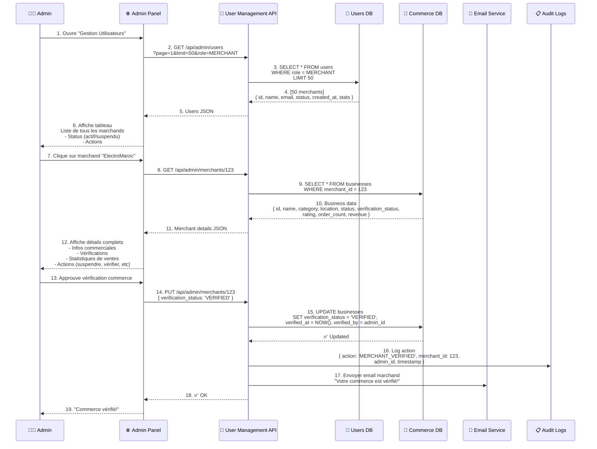
```mermaid
sequenceDiagram
    participant Admin as 👨‍💼 Admin
    participant AdminApp as 🌐 Admin Panel
    participant UserManagementAPI as 👥 User Management API
    participant UserDB as 💾 Users DB
    participant CommercesDB as 🏪 Commerce DB
    participant EmailService as 📧 Email Service
    participant LogsService as 📋 Audit Logs

    Admin->>AdminApp: 1. Ouvre "Gestion Utilisateurs"
    AdminApp->>UserManagementAPI: 2. GET /api/admin/users<br/>?page=1&limit=50&role=MERCHANT
    
    UserManagementAPI->>UserDB: 3. SELECT * FROM users<br/>WHERE role = MERCHANT<br/>LIMIT 50
    
    UserDB-->>UserManagementAPI: 4. [50 merchants]<br/>{ id, name, email, status, created_at, stats }
    
    UserManagementAPI-->>AdminApp: 5. Users JSON
    AdminApp-->>Admin: 6. Affiche tableau<br/>Liste de tous les marchands<br/>- Status (actif/suspendu)<br/>- Actions

    Admin->>AdminApp: 7. Clique sur marchand "ElectroMaroc"
    AdminApp->>UserManagementAPI: 8. GET /api/admin/merchants/123
    
    UserManagementAPI->>CommercesDB: 9. SELECT * FROM businesses<br/>WHERE merchant_id = 123
    
    CommercesDB-->>UserManagementAPI: 10. Business data<br/>{ id, name, category, location, status, verification_status,<br/>rating, order_count, revenue }
    
    UserManagementAPI-->>AdminApp: 11. Merchant details JSON
    AdminApp-->>Admin: 12. Affiche détails complets<br/>- Infos commerciales<br/>- Vérifications<br/>- Statistiques de ventes<br/>- Actions (suspendre, vérifier, etc)

    Admin->>AdminApp: 13. Approuve vérification commerce
    AdminApp->>UserManagementAPI: 14. PUT /api/admin/merchants/123<br/>{ verification_status: 'VERIFIED' }
    
    UserManagementAPI->>CommercesDB: 15. UPDATE businesses<br/>SET verification_status = 'VERIFIED',<br/>verified_at = NOW(), verified_by = admin_id
    
    CommercesDB-->>UserManagementAPI: ✅ Updated
    
    UserManagementAPI->>LogsService: 16. Log action<br/>{ action: 'MERCHANT_VERIFIED', merchant_id: 123,<br/>admin_id, timestamp }
    
    UserManagementAPI->>EmailService: 17. Envoyer email marchand<br/>"Votre commerce est vérifié!"
    
    UserManagementAPI-->>AdminApp: 18. ✅ OK
    AdminApp-->>Admin: 19. "Commerce vérifié!"
```

### 3.3 Détection de Fraude - Monitoring

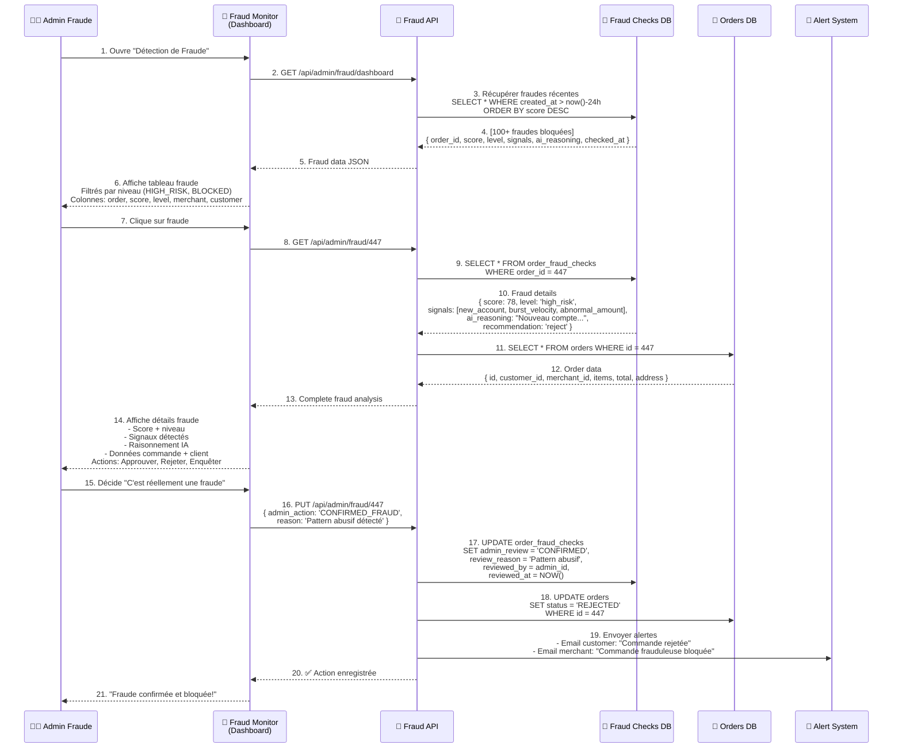
```mermaid
sequenceDiagram
    participant Admin as 👨‍💼 Admin Fraude
    participant FraudMonitor as 🔐 Fraud Monitor<br/>(Dashboard)
    participant FraudAPI as 🔐 Fraud API
    participant FraudDB as 💾 Fraud Checks DB
    participant OrderDB as 💾 Orders DB
    participant EmailAlert as 📧 Alert System

    Admin->>FraudMonitor: 1. Ouvre "Détection de Fraude"
    FraudMonitor->>FraudAPI: 2. GET /api/admin/fraud/dashboard
    
    FraudAPI->>FraudDB: 3. Récupérer fraudes récentes<br/>SELECT * WHERE created_at > now()-24h<br/>ORDER BY score DESC
    
    FraudDB-->>FraudAPI: 4. [100+ fraudes bloquées]<br/>{ order_id, score, level, signals, ai_reasoning, checked_at }
    
    FraudAPI-->>FraudMonitor: 5. Fraud data JSON
    
    FraudMonitor-->>Admin: 6. Affiche tableau fraude<br/>Filtrés par niveau (HIGH_RISK, BLOCKED)<br/>Colonnes: order, score, level, merchant, customer

    Admin->>FraudMonitor: 7. Clique sur fraude #447<br/>Score: 78/100 (HIGH_RISK)
    
    FraudMonitor->>FraudAPI: 8. GET /api/admin/fraud/447
    
    FraudAPI->>FraudDB: 9. SELECT * FROM order_fraud_checks<br/>WHERE order_id = 447
    
    FraudDB-->>FraudAPI: 10. Fraud details<br/>{ score: 78, level: 'high_risk',<br/>signals: [new_account, burst_velocity, abnormal_amount],<br/>ai_reasoning: "Nouveau compte...",<br/>recommendation: 'reject' }
    
    FraudAPI->>OrderDB: 11. SELECT * FROM orders WHERE id = 447
    OrderDB-->>FraudAPI: 12. Order data<br/>{ id, customer_id, merchant_id, items, total, address }
    
    FraudAPI-->>FraudMonitor: 13. Complete fraud analysis
    
    FraudMonitor-->>Admin: 14. Affiche détails fraude<br/>- Score + niveau<br/>- Signaux détectés<br/>- Raisonnement IA<br/>- Données commande + client<br/>Actions: Approuver, Rejeter, Enquêter

    Admin->>FraudMonitor: 15. Décide "C'est réellement une fraude"
    FraudMonitor->>FraudAPI: 16. PUT /api/admin/fraud/447<br/>{ admin_action: 'CONFIRMED_FRAUD',<br/>reason: 'Pattern abusif détecté' }
    
    FraudAPI->>FraudDB: 17. UPDATE order_fraud_checks<br/>SET admin_review = 'CONFIRMED',<br/>review_reason = 'Pattern abusif',<br/>reviewed_by = admin_id,<br/>reviewed_at = NOW()
    
    FraudAPI->>OrderDB: 18. UPDATE orders<br/>SET status = 'REJECTED'<br/>WHERE id = 447
    
    FraudAPI->>EmailAlert: 19. Envoyer alertes<br/>- Email customer: "Commande rejetée"<br/>- Email merchant: "Commande frauduleuse bloquée"
    
    FraudAPI-->>FraudMonitor: 20. ✅ Action enregistrée
    FraudMonitor-->>Admin: 21. "Fraude confirmée et bloquée!"
```

---

## 4. Intégration et Interfaçage des Modules

### 4.1 Architecture d'Authentification Centralisée

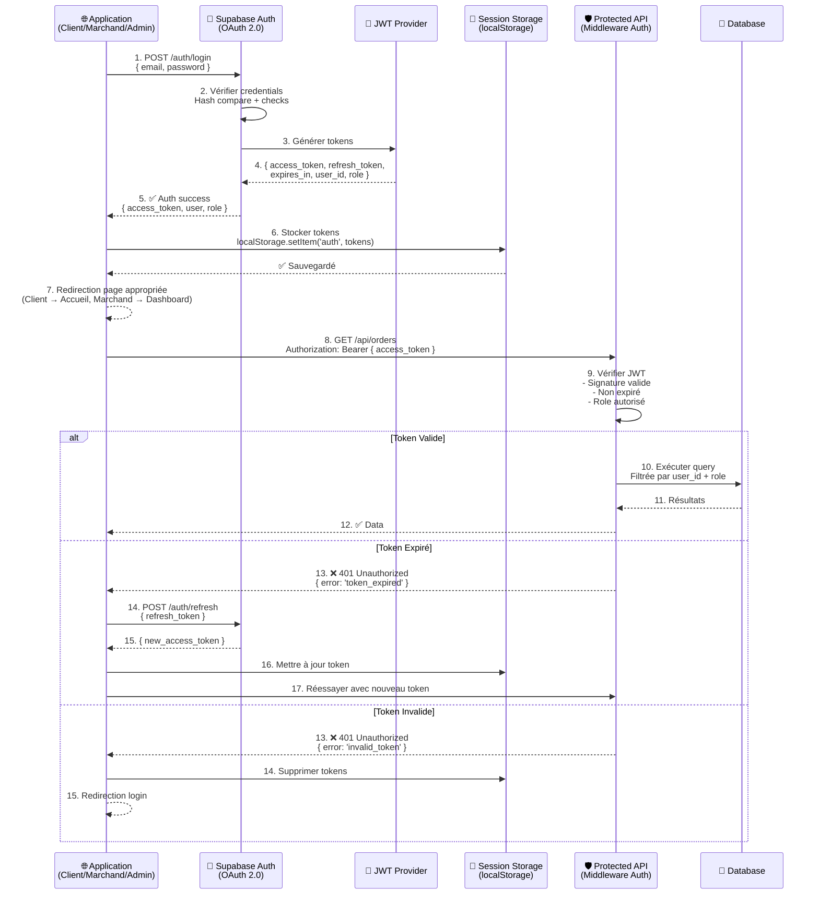
```mermaid
sequenceDiagram
    participant App as 🌐 Application<br/>(Client/Marchand/Admin)
    participant SupabaseAuth as 🔐 Supabase Auth<br/>(OAuth 2.0)
    participant JWTProvider as 🔑 JWT Provider
    participant SessionManager as 💾 Session Storage<br/>(localStorage)
    participant ProtectedAPI as 🛡️ Protected API<br/>(Middleware Auth)
    participant Database as 💾 Database

    App->>SupabaseAuth: 1. POST /auth/login<br/>{ email, password }
    SupabaseAuth->>SupabaseAuth: 2. Vérifier credentials<br/>Hash compare + checks
    
    SupabaseAuth->>JWTProvider: 3. Générer tokens
    JWTProvider-->>SupabaseAuth: 4. { access_token, refresh_token,<br/>expires_in, user_id, role }
    
    SupabaseAuth-->>App: 5. ✅ Auth success<br/>{ access_token, user, role }
    
    App->>SessionManager: 6. Stocker tokens<br/>localStorage.setItem('auth', tokens)
    
    SessionManager-->>App: ✅ Sauvegardé
    
    App-->>App: 7. Redirection page appropriée<br/>(Client → Accueil, Marchand → Dashboard)
    
    App->>ProtectedAPI: 8. GET /api/orders<br/>Authorization: Bearer { access_token }
    
    ProtectedAPI->>ProtectedAPI: 9. Vérifier JWT<br/>- Signature valide<br/>- Non expiré<br/>- Role autorisé
    
    alt Token Valide
        ProtectedAPI->>Database: 10. Exécuter query<br/>Filtrée par user_id + role
        Database-->>ProtectedAPI: 11. Résultats
        ProtectedAPI-->>App: 12. ✅ Data
    else Token Expiré
        ProtectedAPI-->>App: 13. ❌ 401 Unauthorized<br/>{ error: 'token_expired' }
        App->>SupabaseAuth: 14. POST /auth/refresh<br/>{ refresh_token }
        SupabaseAuth-->>App: 15. { new_access_token }
        App->>SessionManager: 16. Mettre à jour token
        App->>ProtectedAPI: 17. Réessayer avec nouveau token
    else Token Invalide
        ProtectedAPI-->>App: 13. ❌ 401 Unauthorized<br/>{ error: 'invalid_token' }
        App->>SessionManager: 14. Supprimer tokens
        App-->>App: 15. Redirection login
    end
```

### 4.2 Pipeline Recherche + Notifications Temps Réel

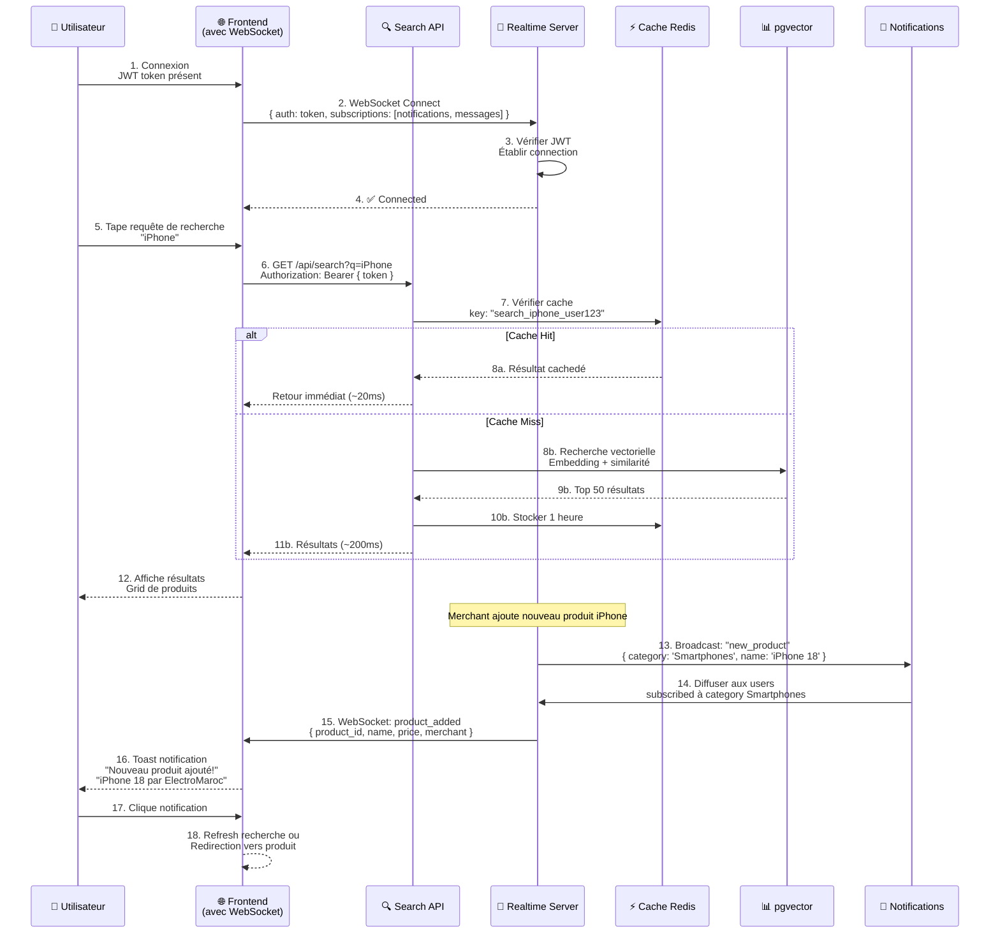
```mermaid
sequenceDiagram
    participant User as 👤 Utilisateur
    participant FrontendApp as 🌐 Frontend<br/>(avec WebSocket)
    participant SearchAPI as 🔍 Search API
    participant RealtimeServer as 🔄 Realtime Server
    participant SearchCache as ⚡ Cache Redis
    participant VectorDB as 📊 pgvector
    participant NotificationService as 🔔 Notifications

    User->>FrontendApp: 1. Connexion<br/>JWT token présent
    FrontendApp->>RealtimeServer: 2. WebSocket Connect<br/>{ auth: token, subscriptions: [notifications, messages] }
    
    RealtimeServer->>RealtimeServer: 3. Vérifier JWT<br/>Établir connection
    RealtimeServer-->>FrontendApp: 4. ✅ Connected

    User->>FrontendApp: 5. Tape requête de recherche<br/>"iPhone"
    
    FrontendApp->>SearchAPI: 6. GET /api/search?q=iPhone<br/>Authorization: Bearer { token }
    
    SearchAPI->>SearchCache: 7. Vérifier cache<br/>key: "search_iphone_user123"
    
    alt Cache Hit
        SearchCache-->>SearchAPI: 8a. Résultat cachedé
        SearchAPI-->>FrontendApp: Retour immédiat (~20ms)
    else Cache Miss
        SearchAPI->>VectorDB: 8b. Recherche vectorielle<br/>Embedding + similarité
        VectorDB-->>SearchAPI: 9b. Top 50 résultats
        SearchAPI->>SearchCache: 10b. Stocker 1 heure
        SearchAPI-->>FrontendApp: 11b. Résultats (~200ms)
    end
    
    FrontendApp-->>User: 12. Affiche résultats<br/>Grid de produits
    
    Note over RealtimeServer: Merchant ajoute nouveau produit iPhone
    
    RealtimeServer->>NotificationService: 13. Broadcast: "new_product"<br/>{ category: 'Smartphones', name: 'iPhone 18' }
    
    NotificationService->>RealtimeServer: 14. Diffuser aux users<br/>subscribed à category Smartphones
    
    RealtimeServer->>FrontendApp: 15. WebSocket: product_added<br/>{ product_id, name, price, merchant }
    
    FrontendApp-->>User: 16. Toast notification<br/>"Nouveau produit ajouté!"<br/>"iPhone 18 par ElectroMaroc"
    
    User->>FrontendApp: 17. Clique notification
    FrontendApp-->>FrontendApp: 18. Refresh recherche ou<br/>Redirection vers produit
```

### 4.3 Flux Complet: Commande + Fraude + Notifications

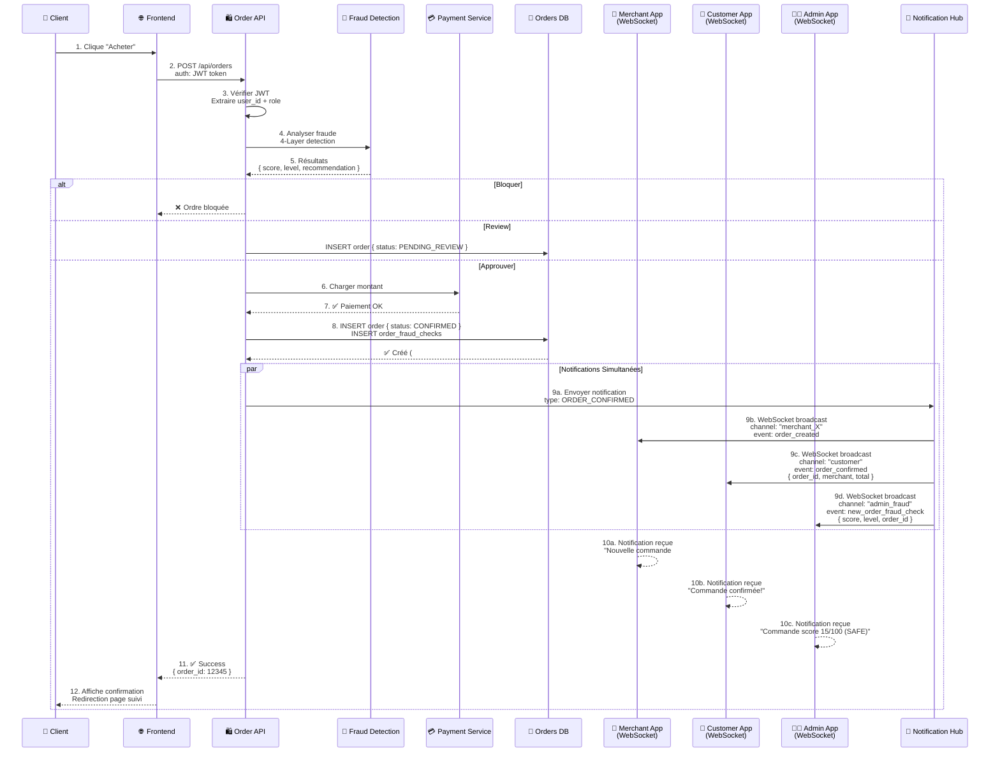
```mermaid
sequenceDiagram
    participant Customer as 👤 Client
    participant FrontendApp as 🌐 Frontend
    participant OrderAPI as 🛍️ Order API
    participant FraudService as 🔐 Fraud Detection
    participant PaymentAPI as 💳 Payment Service
    participant OrderDB as 💾 Orders DB
    participant MerchantApp as 🏪 Merchant App<br/>(WebSocket)
    participant CustomerApp as 👤 Customer App<br/>(WebSocket)
    participant AdminApp as 👨‍💼 Admin App<br/>(WebSocket)
    participant NotificationHub as 🔔 Notification Hub

    Customer->>FrontendApp: 1. Clique "Acheter"
    FrontendApp->>OrderAPI: 2. POST /api/orders<br/>auth: JWT token
    
    OrderAPI->>OrderAPI: 3. Vérifier JWT<br/>Extraire user_id + role
    
    OrderAPI->>FraudService: 4. Analyser fraude<br/>4-Layer detection
    FraudService-->>OrderAPI: 5. Résultats<br/>{ score, level, recommendation }
    
    alt Bloquer
        OrderAPI-->>FrontendApp: ❌ Ordre bloquée
    else Review
        OrderAPI->>OrderDB: INSERT order { status: PENDING_REVIEW }
    else Approuver
        OrderAPI->>PaymentAPI: 6. Charger montant
        PaymentAPI-->>OrderAPI: 7. ✅ Paiement OK
        
        OrderAPI->>OrderDB: 8. INSERT order { status: CONFIRMED }<br/>INSERT order_fraud_checks
        
        OrderDB-->>OrderAPI: ✅ Créé (#12345)
        
        par Notifications Simultanées
            OrderAPI->>NotificationHub: 9a. Envoyer notification<br/>type: ORDER_CONFIRMED
            NotificationHub->>MerchantApp: 9b. WebSocket broadcast<br/>channel: "merchant_X"<br/>event: order_created
            NotificationHub->>CustomerApp: 9c. WebSocket broadcast<br/>channel: "customer"<br/>event: order_confirmed<br/>{ order_id, merchant, total }
            NotificationHub->>AdminApp: 9d. WebSocket broadcast<br/>channel: "admin_fraud"<br/>event: new_order_fraud_check<br/>{ score, level, order_id }
        end
        
        MerchantApp-->>MerchantApp: 10a. Notification reçue<br/>"Nouvelle commande #12345"
        CustomerApp-->>CustomerApp: 10b. Notification reçue<br/>"Commande confirmée!"
        AdminApp-->>AdminApp: 10c. Notification reçue<br/>"Commande score 15/100 (SAFE)"
        
        OrderAPI-->>FrontendApp: 11. ✅ Success<br/>{ order_id: 12345 }
        
        FrontendApp-->>Customer: 12. Affiche confirmation<br/>Redirection page suivi
    end
```

---

## 📊 Résumé d'Intégration

```
┌─────────────────────────────────────────────────────────────────┐
│               ARCHITECTURE GLOBALE D'INTÉGRATION                │
├─────────────────────────────────────────────────────────────────┤

┌─ AUTHENTICATION LAYER (Supabase OAuth 2.0 + JWT)
│  └─ Valide accès pour Client, Marchand, Admin

┌─ API GATEWAY (Protected Routes + Role-Based Access)
│  ├─ /api/client/* → (Customer role)
│  ├─ /api/merchant/* → (Merchant role)
│  └─ /api/admin/* → (Admin role)

┌─ REALTIME LAYER (WebSocket + Supabase Realtime)
│  ├─ Messages temps réel
│  ├─ Notifications
│  ├─ Commandes live
│  └─ Updates tableau de bord

┌─ DATA LAYER (PostgreSQL + Extensions)
│  ├─ Users (avec auth)
│  ├─ Products (avec pgvector embedding)
│  ├─ Orders (avec fraud_checks)
│  ├─ Bookings (avec fraud_checks)
│  ├─ Messages
│  └─ Audit logs

┌─ SERVICES EXTERNES
│  ├─ AI (OpenRouter - Llama, Claude, E5)
│  ├─ Payments (Stripe/Konnect)
│  ├─ Storage (Supabase Storage)
│  ├─ Email (SendGrid)
│  └─ Cache (Redis)

┌─ DETECTORS & ANALYZERS
│  ├─ Fraud Detection (7-signal system)
│  ├─ Embedding Creation (E5-Small)
│  └─ Analytics Engine (real-time metrics)

└─────────────────────────────────────────────────────────────────┘
```

---

## 🎓 Conclusion

Ces diagrammes de séquence montrent:

✅ **Chaque interaction utilisateur** du système  
✅ **Flux de données** entre composants  
✅ **Intégrations temps réel** (WebSocket)  
✅ **Sécurité** (JWT, authentification)  
✅ **Performance** (caching, parallélisation)  
✅ **Resilience** (error handling)  

Pour votre rapport PFE: Ces diagrammes démontrent une **architecture robuste, sécurisée et scalable**! 🚀
