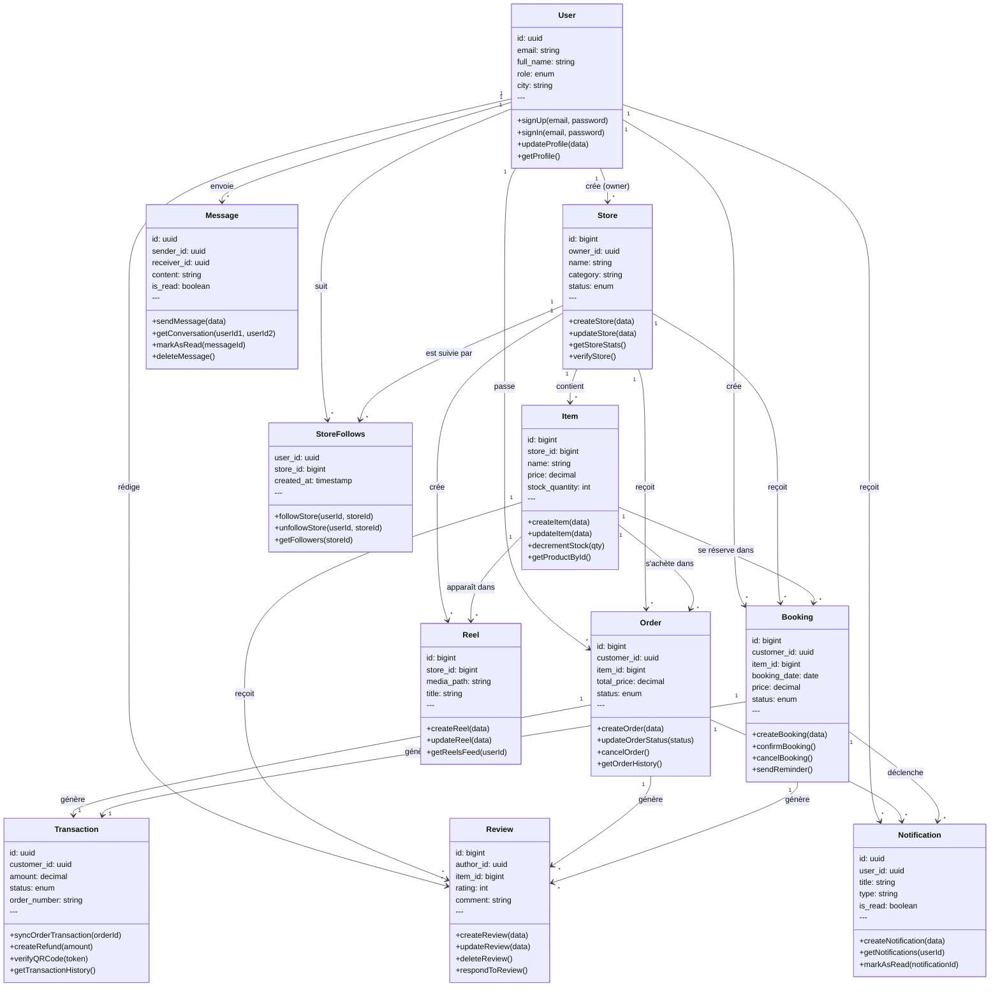

# 📊 Diagramme de Classe Académique - Phantom Marketplace

## Vue d'ensemble UML

---

## 📋 Classes et Champs Essentiels

### 1. **User** (Utilisateur)
- `id` (uuid): Identifiant unique
- `email` (string): Email
- `full_name` (string): Nom complet
- `role` (enum): CLIENT | PRO | ADMIN
- `city` (string): Ville

**Méthodes principales:**
- `signUp(email, password)` → Inscription
- `signIn(email, password)` → Connexion
- `updateProfile(data)` → Mise à jour profil
- `getProfile()` → Récupérer profil

### 2. **Store** (Boutique)
- `id` (bigint): Identifiant unique
- `owner_id` (uuid): Propriétaire (User)
- `name` (string): Nom boutique
- `category` (string): Catégorie
- `status` (enum): PENDING | ACTIVE | SUSPENDED

**Méthodes principales:**
- `createStore(data)` → Créer boutique
- `updateStore(data)` → Mettre à jour
- `getStoreStats()` → Statistiques ventes
- `verifyStore()` → Vérifier boutique

### 3. **Item** (Produit/Service)
- `id` (bigint): Identifiant unique
- `store_id` (bigint): Boutique (Store)
- `name` (string): Nom produit
- `price` (decimal): Prix
- `stock_quantity` (int): Stock

**Méthodes principales:**
- `createItem(data)` → Créer produit
- `updateItem(data)` → Mettre à jour
- `decrementStock(qty)` → Réduire stock
- `getProductById()` → Récupérer produit

### 4. **Order** (Commande)
- `id` (bigint): Identifiant unique
- `customer_id` (uuid): Client (User)
- `item_id` (bigint): Produit (Item)
- `total_price` (decimal): Prix total
- `status` (enum): PENDING | PAID | SHIPPED | COMPLETED

**Méthodes principales:**
- `createOrder(data)` → Créer commande
- `updateOrderStatus(status)` → Mettre à jour statut
- `cancelOrder()` → Annuler commande
- `getOrderHistory()` → Historique commandes

### 5. **Booking** (Réservation)
- `id` (bigint): Identifiant unique
- `customer_id` (uuid): Client (User)
- `item_id` (bigint): Service (Item)
- `booking_date` (date): Date réservation
- `price` (decimal): Prix
- `status` (enum): PENDING | CONFIRMED | COMPLETED

**Méthodes principales:**
- `createBooking(data)` → Créer réservation
- `confirmBooking()` → Confirmer
- `cancelBooking()` → Annuler
- `sendReminder()` → Rappel 24h

### 6. **Review** (Avis)
- `id` (bigint): Identifiant unique
- `author_id` (uuid): Auteur (User)
- `item_id` (bigint): Produit (Item)
- `rating` (int): Note 1-5
- `comment` (string): Texte avis

**Méthodes principales:**
- `createReview(data)` → Poster avis
- `updateReview(data)` → Modifier avis
- `deleteReview()` → Supprimer avis
- `respondToReview()` → Répondre vendeur

### 7. **Transaction** (Paiement)
- `id` (uuid): Identifiant unique
- `customer_id` (uuid): Client (User)
- `amount` (decimal): Montant
- `status` (enum): pending | completed | failed
- `order_number` (string): Référence commande

**Méthodes principales:**
- `syncOrderTransaction(orderId)` → Synchroniser paiement
- `createRefund(amount)` → Créer remboursement
- `verifyQRCode(token)` → Vérifier QR code
- `getTransactionHistory()` → Historique transactions

### 8. **StoreFollows** (Suivi Boutique)
- `user_id` (uuid): Utilisateur (User)
- `store_id` (bigint): Boutique (Store)
- `created_at` (timestamp): Date suivi

**Méthodes principales:**
- `followStore(userId, storeId)` → Suivre boutique
- `unfollowStore(userId, storeId)` → Arrêter de suivre
- `getFollowers(storeId)` → Lister followers

### 9. **Reel** (Vidéo TikTok)
- `id` (bigint): Identifiant unique
- `store_id` (bigint): Boutique (Store)
- `media_path` (string): Chemin média
- `title` (string): Titre

**Méthodes principales:**
- `createReel(data)` → Ajouter vidéo
- `updateReel(data)` → Mettre à jour vidéo
- `getReelsFeed(userId)` → Feed personnalisé

### 10. **Notification** (Notifications)
- `id` (uuid): Identifiant unique
- `user_id` (uuid): Utilisateur (User)
- `title` (string): Titre
- `type` (string): Type notification
- `is_read` (boolean): Lu/non lu

**Méthodes principales:**
- `createNotification(data)` → Créer notification
- `getNotifications(userId)` → Récupérer notifications
- `markAsRead(notificationId)` → Marquer comme lu

### 11. **Message** (Messages Directs)
- `id` (uuid): Identifiant unique
- `sender_id` (uuid): Expéditeur (User)
- `receiver_id` (uuid): Destinataire (User)
- `content` (string): Contenu
- `is_read` (boolean): Lu/non lu

**Méthodes principales:**
- `sendMessage(data)` → Envoyer message
- `getConversation(userId1, userId2)` → Récupérer conversation
- `markAsRead(messageId)` → Marquer lu
- `deleteMessage()` → Supprimer message

---

## 🔗 Relations Principales

| De | À | Type | Description |
|---|---|---|---|
| User | Store | 1-vers-* | Un utilisateur crée plusieurs boutiques |
| User | Order | 1-vers-* | Un client passe plusieurs commandes |
| User | Booking | 1-vers-* | Un client crée plusieurs réservations |
| User | Review | 1-vers-* | Un utilisateur rédige plusieurs avis |
| User | Message | 1-vers-* | Un utilisateur envoie plusieurs messages |
| User | Notification | 1-vers-* | Un utilisateur reçoit plusieurs notifications |
| User | StoreFollows | 1-vers-* | Un utilisateur suit plusieurs boutiques |
| Store | Item | 1-vers-* | Une boutique vend plusieurs produits |
| Store | Order | 1-vers-* | Une boutique reçoit plusieurs commandes |
| Store | Booking | 1-vers-* | Une boutique reçoit plusieurs réservations |
| Store | Reel | 1-vers-* | Une boutique crée plusieurs vidéos |
| Store | StoreFollows | 1-vers-* | Une boutique est suivie par plusieurs utilisateurs |
| Item | Order | 1-vers-* | Un produit peut être commandé plusieurs fois |
| Item | Booking | 1-vers-* | Un service peut être réservé plusieurs fois |
| Item | Review | 1-vers-* | Un produit reçoit plusieurs avis |
| Item | Reel | 1-vers-* | Un produit peut apparaître dans plusieurs réels |
| Order | Transaction | 1-vers-1 | Une commande génère une transaction |
| Order | Review | 1-vers-* | Une commande peut générer un avis |
| Order | Notification | 1-vers-* | Une commande déclenche des notifications |
| Booking | Transaction | 1-vers-1 | Une réservation génère une transaction |
| Booking | Review | 1-vers-* | Une réservation peut générer un avis |
| Booking | Notification | 1-vers-* | Une réservation déclenche des notifications |

---

**Diagramme Académique Complet | 11 Classes | Phantom Marketplace v4.4**
