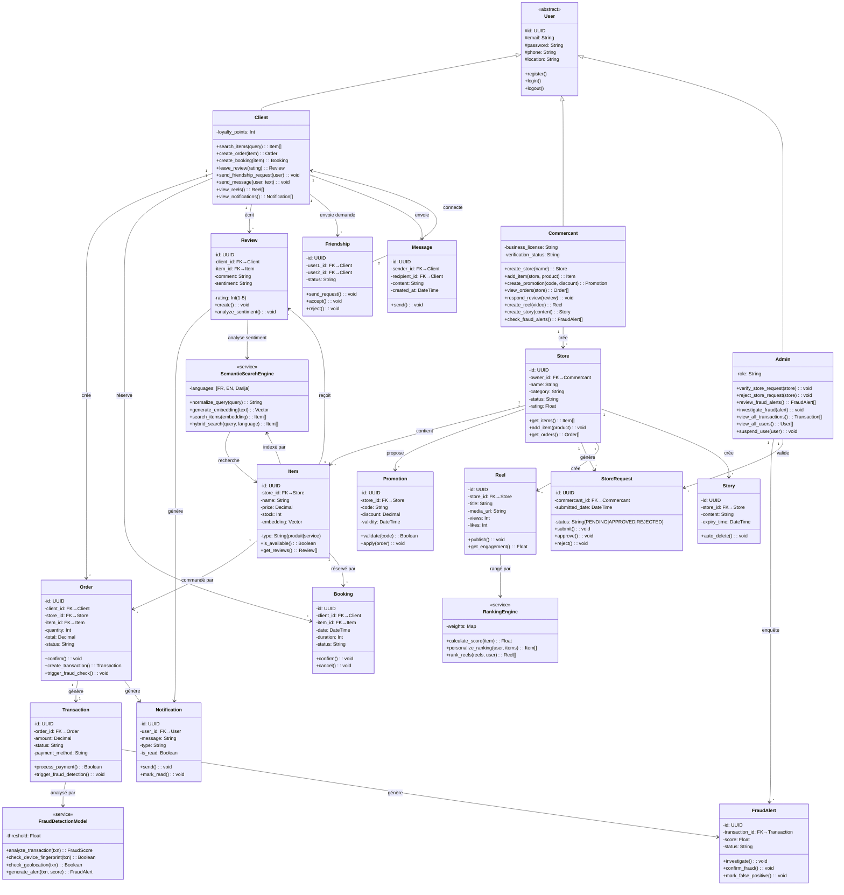

# 🎓 DIAGRAMME DE CLASSES SIMPLE - ACADÉMIQUE

## Architecture Simple: 3 Acteurs + 8 Classes Métier + 3 Systèmes IA



---

## 📊 TABLEAU RÉCAPITULATIF

| Classe | Type | Responsabilité |
|--------|------|-----------------|
| **User** | Abstract | Base pour tous les acteurs |
| **Client** | Actor | Achat, réservation, social, recherche |
| **Commercant** | Actor | Gestion boutique, produits, promotions |
| **Admin** | Actor | Modération, fraude, vérification |
| **Store** | Entity | Boutique avec owner=Commercant |
| **Item** | Entity | Produit/Service (1+ par store) |
| **Order** | Entity | Commande client → Transaction |
| **Booking** | Entity | Réservation service |
| **Transaction** | Entity | Paiement → Fraude check |
| **Review** | Entity | Avis + sentiment |
| **Promotion** | Entity | Code remise store |
| **StoreRequest** | Entity | Demande création boutique |
| **Reel** | Entity | Vidéo court-form (store) |
| **Story** | Entity | Contenu éphémère 24h (store) |
| **Notification** | Entity | Alerte utilisateur |
| **Friendship** | Entity | Connexion entre clients |
| **Message** | Entity | Chat P2P |
| **FraudDetectionModel** | Service IA | Analyse fraude 4-couches |
| **SemanticSearchEngine** | Service IA | Recherche multilangue |
| **RankingEngine** | Service IA | Optimisation CTR reels |
| **FraudAlert** | Entity | Alerte fraude admin |

---

## 💾 SCHÉMA BASE DE DONNÉES (SQL Réel)

### **Table Users**
```sql
CREATE TABLE users (
    id UUID PRIMARY KEY DEFAULT gen_random_uuid(),
    email VARCHAR(255) UNIQUE NOT NULL,
    password_hash VARCHAR(255) NOT NULL,
    full_name VARCHAR(255) NOT NULL,
    phone VARCHAR(20),
    location GEOMETRY(Point, 4326),
    user_type ENUM('CLIENT', 'COMMERCANT', 'ADMIN'),
    status VARCHAR(50) DEFAULT 'ACTIVE',
    created_at TIMESTAMP DEFAULT NOW(),
    updated_at TIMESTAMP DEFAULT NOW()
);

CREATE INDEX idx_users_email ON users(email);
CREATE INDEX idx_users_location ON users USING GIST(location);
```

### **Table Stores**
```sql
CREATE TABLE stores (
    id UUID PRIMARY KEY DEFAULT gen_random_uuid(),
    owner_id UUID NOT NULL REFERENCES users(id),
    name VARCHAR(255) NOT NULL,
    category VARCHAR(100),
    description TEXT,
    location GEOMETRY(Point, 4326),
    logo_url VARCHAR(500),
    status VARCHAR(50) DEFAULT 'PENDING',
    rating DECIMAL(2,1) DEFAULT 0,
    total_reviews INT DEFAULT 0,
    created_at TIMESTAMP DEFAULT NOW(),
    updated_at TIMESTAMP DEFAULT NOW()
);

CREATE INDEX idx_stores_owner ON stores(owner_id);
CREATE INDEX idx_stores_location ON stores USING GIST(location);
```

### **Table Items (Produits/Services)**
```sql
CREATE TABLE items (
    id UUID PRIMARY KEY DEFAULT gen_random_uuid(),
    store_id UUID NOT NULL REFERENCES stores(id),
    item_type VARCHAR(50), -- 'produit' ou 'service'
    name VARCHAR(255) NOT NULL,
    description TEXT,
    price DECIMAL(10,2) NOT NULL,
    stock_quantity INT DEFAULT 0,
    image_url VARCHAR(500),
    embedding VECTOR(1024), -- pgvector pour recherche sémantique
    status VARCHAR(50) DEFAULT 'ACTIVE',
    rating DECIMAL(2,1) DEFAULT 0,
    created_at TIMESTAMP DEFAULT NOW(),
    updated_at TIMESTAMP DEFAULT NOW()
);

CREATE INDEX idx_items_store ON items(store_id);
CREATE INDEX idx_items_embedding ON items USING ivfflat(embedding vector_cosine_ops);
```

### **Table Orders**
```sql
CREATE TABLE orders (
    id UUID PRIMARY KEY DEFAULT gen_random_uuid(),
    order_number VARCHAR(50) UNIQUE,
    client_id UUID NOT NULL REFERENCES users(id),
    store_id UUID NOT NULL REFERENCES stores(id),
    item_id UUID NOT NULL REFERENCES items(id),
    quantity INT NOT NULL,
    total_price DECIMAL(10,2) NOT NULL,
    status VARCHAR(50) DEFAULT 'PENDING', -- PENDING, CONFIRMED, SHIPPED, DELIVERED
    delivery_address TEXT,
    created_at TIMESTAMP DEFAULT NOW(),
    updated_at TIMESTAMP DEFAULT NOW()
);

CREATE INDEX idx_orders_client ON orders(client_id);
CREATE INDEX idx_orders_store ON orders(store_id);
```

### **Table Bookings (Réservations)**
```sql
CREATE TABLE bookings (
    id UUID PRIMARY KEY DEFAULT gen_random_uuid(),
    booking_number VARCHAR(50) UNIQUE,
    client_id UUID NOT NULL REFERENCES users(id),
    item_id UUID NOT NULL REFERENCES items(id),
    store_id UUID NOT NULL REFERENCES stores(id),
    booking_date DATE NOT NULL,
    duration_minutes INT NOT NULL,
    status VARCHAR(50) DEFAULT 'PENDING',
    notes TEXT,
    created_at TIMESTAMP DEFAULT NOW()
);

CREATE INDEX idx_bookings_client ON bookings(client_id);
CREATE INDEX idx_bookings_date ON bookings(booking_date);
```

### **Table Transactions**
```sql
CREATE TABLE transactions (
    id UUID PRIMARY KEY DEFAULT gen_random_uuid(),
    order_id UUID REFERENCES orders(id),
    client_id UUID NOT NULL REFERENCES users(id),
    store_id UUID NOT NULL REFERENCES stores(id),
    amount DECIMAL(10,2) NOT NULL,
    currency VARCHAR(3) DEFAULT 'TND',
    payment_method VARCHAR(50), -- stripe, mobile_money, etc
    status VARCHAR(50) DEFAULT 'PENDING', -- PENDING, SUCCESS, FAILED, REFUNDED
    transaction_id VARCHAR(255), -- ID externe Stripe
    fraud_score DECIMAL(3,2) DEFAULT 0, -- 0-1
    created_at TIMESTAMP DEFAULT NOW()
);

CREATE INDEX idx_transactions_client ON transactions(client_id);
CREATE INDEX idx_transactions_status ON transactions(status);
```

### **Table Reviews**
```sql
CREATE TABLE reviews (
    id UUID PRIMARY KEY DEFAULT gen_random_uuid(),
    client_id UUID NOT NULL REFERENCES users(id),
    item_id UUID NOT NULL REFERENCES items(id),
    store_id UUID NOT NULL REFERENCES stores(id),
    rating INT NOT NULL CHECK (rating >= 1 AND rating <= 5),
    comment TEXT,
    sentiment VARCHAR(50), -- positive, negative, neutral
    verified_purchase BOOLEAN DEFAULT FALSE,
    helpful_count INT DEFAULT 0,
    created_at TIMESTAMP DEFAULT NOW()
);

CREATE INDEX idx_reviews_item ON reviews(item_id);
CREATE INDEX idx_reviews_store ON reviews(store_id);
```

### **Table Promotions**
```sql
CREATE TABLE promotions (
    id UUID PRIMARY KEY DEFAULT gen_random_uuid(),
    store_id UUID NOT NULL REFERENCES stores(id),
    code VARCHAR(50) NOT NULL UNIQUE,
    discount_value DECIMAL(10,2) NOT NULL,
    discount_type VARCHAR(50), -- percentage, fixed
    min_order_amount DECIMAL(10,2),
    usage_limit INT,
    usage_count INT DEFAULT 0,
    start_date TIMESTAMP NOT NULL,
    end_date TIMESTAMP NOT NULL,
    is_active BOOLEAN DEFAULT TRUE,
    created_at TIMESTAMP DEFAULT NOW()
);

CREATE INDEX idx_promotions_store ON promotions(store_id);
CREATE INDEX idx_promotions_code ON promotions(code);
```

### **Table StoreRequests**
```sql
CREATE TABLE store_requests (
    id UUID PRIMARY KEY DEFAULT gen_random_uuid(),
    commercant_id UUID NOT NULL REFERENCES users(id),
    store_name VARCHAR(255) NOT NULL,
    category VARCHAR(100),
    business_license VARCHAR(255),
    status VARCHAR(50) DEFAULT 'PENDING', -- PENDING, APPROVED, REJECTED
    rejection_reason TEXT,
    submitted_at TIMESTAMP DEFAULT NOW(),
    reviewed_at TIMESTAMP,
    reviewed_by UUID REFERENCES users(id)
);

CREATE INDEX idx_requests_commercant ON store_requests(commercant_id);
CREATE INDEX idx_requests_status ON store_requests(status);
```

### **Table FraudAlerts**
```sql
CREATE TABLE fraud_alerts (
    id UUID PRIMARY KEY DEFAULT gen_random_uuid(),
    transaction_id UUID NOT NULL REFERENCES transactions(id),
    fraud_score DECIMAL(3,2) NOT NULL,
    risk_level VARCHAR(50), -- low, medium, high, critical
    status VARCHAR(50) DEFAULT 'INVESTIGATING', -- INVESTIGATING, CONFIRMED, FALSE_POSITIVE
    evidence JSONB, -- détails analyse fraude
    investigated_by UUID REFERENCES users(id),
    created_at TIMESTAMP DEFAULT NOW(),
    resolved_at TIMESTAMP
);

CREATE INDEX idx_fraud_alerts_status ON fraud_alerts(status);
```

### **Table Reels**
```sql
CREATE TABLE reels (
    id UUID PRIMARY KEY DEFAULT gen_random_uuid(),
    store_id UUID NOT NULL REFERENCES stores(id),
    title VARCHAR(255),
    description TEXT,
    media_url VARCHAR(500) NOT NULL,
    duration INT,
    views INT DEFAULT 0,
    likes INT DEFAULT 0,
    shares INT DEFAULT 0,
    status VARCHAR(50) DEFAULT 'PUBLISHED',
    created_at TIMESTAMP DEFAULT NOW()
);

CREATE INDEX idx_reels_store ON reels(store_id);
```

### **Table Stories**
```sql
CREATE TABLE stories (
    id UUID PRIMARY KEY DEFAULT gen_random_uuid(),
    store_id UUID NOT NULL REFERENCES stores(id),
    content TEXT,
    media_url VARCHAR(500),
    created_at TIMESTAMP DEFAULT NOW(),
    expires_at TIMESTAMP NOT NULL DEFAULT (NOW() + INTERVAL '24 hours')
);

CREATE INDEX idx_stories_expiry ON stories(expires_at);
```

### **Table Notifications**
```sql
CREATE TABLE notifications (
    id UUID PRIMARY KEY DEFAULT gen_random_uuid(),
    user_id UUID NOT NULL REFERENCES users(id),
    title VARCHAR(255) NOT NULL,
    message TEXT NOT NULL,
    type VARCHAR(50), -- order_update, new_reel, fraud_alert, etc
    is_read BOOLEAN DEFAULT FALSE,
    created_at TIMESTAMP DEFAULT NOW()
);

CREATE INDEX idx_notifications_user ON notifications(user_id);
CREATE INDEX idx_notifications_unread ON notifications(user_id, is_read);
```

### **Table Friendships**
```sql
CREATE TABLE friendships (
    id UUID PRIMARY KEY DEFAULT gen_random_uuid(),
    user1_id UUID NOT NULL REFERENCES users(id),
    user2_id UUID NOT NULL REFERENCES users(id),
    status VARCHAR(50) DEFAULT 'PENDING', -- PENDING, ACCEPTED, BLOCKED
    created_at TIMESTAMP DEFAULT NOW(),
    CONSTRAINT different_users CHECK (user1_id < user2_id)
);

CREATE INDEX idx_friendships_user1 ON friendships(user1_id);
CREATE INDEX idx_friendships_user2 ON friendships(user2_id);
```

### **Table Messages**
```sql
CREATE TABLE messages (
    id UUID PRIMARY KEY DEFAULT gen_random_uuid(),
    sender_id UUID NOT NULL REFERENCES users(id),
    recipient_id UUID NOT NULL REFERENCES users(id),
    content TEXT NOT NULL,
    is_read BOOLEAN DEFAULT FALSE,
    created_at TIMESTAMP DEFAULT NOW()
);

CREATE INDEX idx_messages_recipient ON messages(recipient_id, is_read);
```

---

## 🔧 FONCTIONS CODE RÉEL (TypeScript/Next.js)

### **Client Service - Search & Order**
```typescript
// client.service.ts
import { db } from '@/lib/db';

export class ClientService {
  // 1️⃣ RECHERCHE SÉMANTIQUE
  async search_items(query: string, language: string = 'fr'): Promise<Item[]> {
    try {
      // Étape 1: Normaliser la requête
      const normalized = this.normalize_query(query, language);
      
      // Étape 2: Générer l'embedding
      const embedding = await this.generateEmbedding(normalized);
      
      // Étape 3: Recherche vectorielle
      const results = await db.query(`
        SELECT * FROM items 
        WHERE embedding <-> $1 < 0.3
        ORDER BY embedding <-> $1 ASC
        LIMIT 10
      `, [embedding]);
      
      // Étape 4: Ranking personnalisé
      const ranked = await this.rankingEngine.personalize_ranking(
        results,
        { user_location: this.userLocation }
      );
      
      return ranked;
    } catch (error) {
      console.error('Search error:', error);
      throw error;
    }
  }

  // 2️⃣ CRÉER COMMANDE
  async create_order(itemId: string, quantity: number, address: string): Promise<Order> {
    const session = await this.getSession();
    const clientId = session.user.id;

    // Créer la commande
    const order = await db.orders.create({
      client_id: clientId,
      item_id: itemId,
      quantity,
      delivery_address: address,
      status: 'PENDING'
    });

    // Créer la transaction
    const item = await db.items.findById(itemId);
    const transaction = await db.transactions.create({
      order_id: order.id,
      client_id: clientId,
      store_id: item.store_id,
      amount: item.price * quantity,
      status: 'PENDING'
    });

    // 🚨 Déclencher détection fraude
    await this.triggerFraudDetection(transaction);

    // Créer notification au commercant
    await this.sendNotification(item.store_id, `Nouvelle commande ${order.order_number}`);

    return order;
  }

  // 3️⃣ LAISSER UN AVIS
  async leave_review(itemId: string, rating: number, comment: string): Promise<Review> {
    const session = await this.getSession();
    
    const review = await db.reviews.create({
      client_id: session.user.id,
      item_id: itemId,
      rating,
      comment,
      verified_purchase: true
    });

    // Analyser sentiment
    const sentiment = await this.semanticSearch.analyze_sentiment(comment);
    await db.reviews.update(review.id, { sentiment });

    return review;
  }

  // 4️⃣ ENVOYER DEMANDE D'AMITIÉ
  async send_friendship_request(userId: string): Promise<void> {
    const session = await this.getSession();
    
    await db.friendships.create({
      user1_id: session.user.id,
      user2_id: userId,
      status: 'PENDING'
    });

    await this.sendNotification(userId, `${session.user.name} vous a envoyé une demande d'amitié`);
  }

  // 5️⃣ ENVOYER MESSAGE
  async send_message(recipientId: string, content: string): Promise<void> {
    const session = await this.getSession();
    
    await db.messages.create({
      sender_id: session.user.id,
      recipient_id: recipientId,
      content
    });

    await this.sendNotification(recipientId, `Nouveau message de ${session.user.name}`);
  }

  // Helper: Normaliser requête (Darija → FR)
  private normalize_query(query: string, language: string): string {
    if (language === 'darija') {
      return this.darijaToFrench(query);
    }
    return query.toLowerCase().trim();
  }

  // Helper: Générer embedding
  private async generateEmbedding(text: string): Promise<number[]> {
    const response = await fetch('https://api.openrouter.ai/api/v1/embeddings', {
      method: 'POST',
      headers: {
        'Authorization': `Bearer ${process.env.OPENROUTER_API_KEY}`,
        'Content-Type': 'application/json'
      },
      body: JSON.stringify({
        model: 'baai/bge-m3',
        input: text
      })
    });
    
    const data = await response.json();
    return data.data[0].embedding;
  }
}
```

### **Commercant Service - Store Management**
```typescript
// commercant.service.ts

export class CommercantService {
  // 1️⃣ CRÉER BOUTIQUE
  async create_store(name: string, category: string): Promise<Store> {
    const session = await this.getSession();
    
    // Soumettre demande création
    const request = await db.store_requests.create({
      commercant_id: session.user.id,
      store_name: name,
      category,
      status: 'PENDING'
    });

    // Notifier admin
    await this.sendNotificationToAdmin(`Nouvelle demande boutique: ${name}`);

    return { id: request.id, status: 'PENDING' };
  }

  // 2️⃣ AJOUTER PRODUIT/SERVICE
  async add_item(storeId: string, itemData: ItemInput): Promise<Item> {
    const session = await this.getSession();

    // Créer le produit
    const item = await db.items.create({
      store_id: storeId,
      item_type: itemData.type, // 'produit' ou 'service'
      name: itemData.name,
      price: itemData.price,
      stock_quantity: itemData.stock,
      description: itemData.description
    });

    // Générer l'embedding
    const embedding = await this.semanticSearch.generate_embedding(
      `${item.name} ${item.description}`
    );
    
    await db.items.update(item.id, { embedding });

    // Notifier clients suivants la boutique
    await this.notifyFollowers(storeId, `Nouveau produit: ${item.name}`);

    return item;
  }

  // 3️⃣ CRÉER PROMOTION
  async create_promotion(
    storeId: string,
    code: string,
    discountValue: number,
    endDate: Date
  ): Promise<Promotion> {
    const promotion = await db.promotions.create({
      store_id: storeId,
      code,
      discount_value: discountValue,
      end_date: endDate,
      is_active: true
    });

    // Notifier clients
    await this.notifyFollowers(storeId, `Nouvelle promo: ${code} - ${discountValue}%`);

    return promotion;
  }

  // 4️⃣ CONSULTER COMMANDES
  async view_orders(storeId: string): Promise<Order[]> {
    const session = await this.getSession();

    // Vérifier ownership
    const store = await db.stores.findById(storeId);
    if (store.owner_id !== session.user.id) {
      throw new Error('Unauthorized');
    }

    return db.orders.findBy({ store_id: storeId });
  }

  // 5️⃣ RÉPONDRE AUX AVIS
  async respond_review(reviewId: string, response: string): Promise<void> {
    await db.reviews.addResponse(reviewId, {
      response,
      responded_by: 'commercant'
    });

    const review = await db.reviews.findById(reviewId);
    await this.sendNotification(review.client_id, `Réponse du vendeur: ${response}`);
  }

  // 6️⃣ CRÉER REEL
  async create_reel(storeId: string, title: string, mediaUrl: string): Promise<Reel> {
    const reel = await db.reels.create({
      store_id: storeId,
      title,
      media_url: mediaUrl,
      status: 'PUBLISHED'
    });

    await this.notifyFollowers(storeId, `Nouveau reel: ${title}`);

    return reel;
  }

  // 7️⃣ CRÉER STORY
  async create_story(storeId: string, content: string, mediaUrl?: string): Promise<Story> {
    const story = await db.stories.create({
      store_id: storeId,
      content,
      media_url: mediaUrl,
      expires_at: new Date(Date.now() + 24 * 60 * 60 * 1000) // 24h
    });

    return story;
  }

  // 8️⃣ CONSULTER ALERTES FRAUDE
  async check_fraud_alerts(storeId: string): Promise<FraudAlert[]> {
    return db.fraud_alerts.findBy({
      store_id: storeId,
      status: 'INVESTIGATING'
    });
  }
}
```

### **Admin Service - Moderation & Fraud**
```typescript
// admin.service.ts

export class AdminService {
  // 1️⃣ VALIDER CRÉATION BOUTIQUE
  async verify_store_request(requestId: string, approved: boolean): Promise<void> {
    const session = await this.getSession();

    if (approved) {
      const request = await db.store_requests.findById(requestId);
      
      // Créer la boutique
      const store = await db.stores.create({
        owner_id: request.commercant_id,
        name: request.store_name,
        category: request.category,
        status: 'ACTIVE'
      });

      // Mettre à jour la demande
      await db.store_requests.update(requestId, {
        status: 'APPROVED',
        reviewed_by: session.user.id,
        reviewed_at: new Date()
      });

      // Notifier commercant
      await this.sendNotification(
        request.commercant_id,
        `Votre boutique "${store.name}" a été approuvée! 🎉`
      );
    } else {
      await db.store_requests.update(requestId, {
        status: 'REJECTED',
        reviewed_by: session.user.id,
        reviewed_at: new Date()
      });

      const request = await db.store_requests.findById(requestId);
      await this.sendNotification(
        request.commercant_id,
        `Votre demande boutique a été rejetée.`
      );
    }
  }

  // 2️⃣ ENQUÊTER FRAUDE
  async investigate_fraud(alertId: string, decision: 'CONFIRMED' | 'FALSE_POSITIVE'): Promise<void> {
    const session = await this.getSession();

    const alert = await db.fraud_alerts.findById(alertId);

    if (decision === 'CONFIRMED') {
      // Fraude confirmée
      await db.transactions.update(alert.transaction_id, { status: 'FAILED' });
      
      // Refund
      await this.processRefund(alert.transaction_id);

      // Suspendre utilisateur
      const transaction = await db.transactions.findById(alert.transaction_id);
      await db.users.update(transaction.client_id, { status: 'SUSPENDED' });

      // Notifier client
      await this.sendNotification(
        transaction.client_id,
        `⚠️ Votre compte a été suspendu suite à détection fraude.`
      );
    } else {
      // Faux positif
      await db.fraud_alerts.update(alertId, { status: 'FALSE_POSITIVE' });
      
      const transaction = await db.transactions.findById(alert.transaction_id);
      await db.transactions.update(alert.transaction_id, { status: 'SUCCESS' });

      // Notifier client
      await this.sendNotification(
        transaction.client_id,
        `✅ Votre transaction a été validée.`
      );
    }

    // Logger action admin
    await this.logAudit({
      admin_id: session.user.id,
      action: `FRAUD_${decision}`,
      alert_id: alertId
    });
  }

  // 3️⃣ CONSULTER ALERTES FRAUDE
  async review_fraud_alerts(): Promise<FraudAlert[]> {
    return db.fraud_alerts.findBy({
      status: 'INVESTIGATING'
    });
  }

  // 4️⃣ CONSULTER TOUTES TRANSACTIONS
  async view_all_transactions(filters?: TransactionFilters): Promise<Transaction[]> {
    return db.transactions.findBy(filters);
  }

  // 5️⃣ CONSULTER TOUS LES USERS
  async view_all_users(): Promise<User[]> {
    return db.users.findAll();
  }

  // 6️⃣ SUSPENDRE UTILISATEUR
  async suspend_user(userId: string, reason: string): Promise<void> {
    await db.users.update(userId, {
      status: 'SUSPENDED'
    });

    await this.sendNotification(
      userId,
      `⚠️ Votre compte a été suspendu. Raison: ${reason}`
    );

    await this.logAudit({
      admin_id: await this.getCurrentAdminId(),
      action: 'USER_SUSPENDED',
      user_id: userId,
      reason
    });
  }
}
```

### **Fraud Detection Model - IA Service**
```typescript
// fraud-detection.service.ts

export class FraudDetectionModel {
  threshold = 0.7; // Score >= 0.7 = alerte

  async analyze_transaction(transactionId: string): Promise<FraudScore> {
    const transaction = await db.transactions.findById(transactionId);
    const user = await db.users.findById(transaction.client_id);

    let score = 0;

    // 🔴 Couche 1: Heuristiques
    score += this.checkHeuristics(transaction);

    // 🔴 Couche 2: Device Fingerprint & Géolocalisation
    score += await this.checkDeviceFingerprint(transaction);

    // 🔴 Couche 3: Analyse embeddings
    score += await this.analyzeUserProfile(user);

    // 🔴 Couche 4: LLM Analysis (Gemini)
    score += await this.runLLMAnalysis(transaction, user);

    // Normaliser score 0-1
    const normalizedScore = Math.min(score / 4, 1);

    // Créer alert si score > threshold
    if (normalizedScore > this.threshold) {
      await this.generateAlert(transactionId, normalizedScore);
    }

    return { score: normalizedScore, isAnomalous: normalizedScore > this.threshold };
  }

  private checkHeuristics(txn: Transaction): number {
    let score = 0;

    // Montant elevé
    if (txn.amount > 1000) score += 0.3;

    // Compte récent
    const userCreatedDaysAgo = Math.floor((Date.now() - new Date(txn.user_created_at).getTime()) / (1000 * 60 * 60 * 24));
    if (userCreatedDaysAgo < 7) score += 0.2;

    // Trop de commandes en 24h
    const ordersLast24h = db.orders.count({ client_id: txn.client_id, created_at: Date.now() - 24*60*60*1000 });
    if (ordersLast24h > 5) score += 0.25;

    return score;
  }

  private async checkDeviceFingerprint(txn: Transaction): Promise<number> {
    const deviceHash = this.getDeviceHash();
    const userDeviceHistory = await db.query(`
      SELECT DISTINCT device_hash FROM transactions 
      WHERE client_id = $1 
      LIMIT 10
    `, [txn.client_id]);

    const isNewDevice = !userDeviceHistory.some(h => h.device_hash === deviceHash);
    return isNewDevice ? 0.2 : 0;
  }

  private async analyzeUserProfile(user: User): Promise<number> {
    // Obtenir embedding profil utilisateur (basé sur ses reviews)
    const userEmbedding = await this.generateUserEmbedding(user.id);
    
    // Comparer avec "normal user" embedding
    const distance = this.cosineDistance(userEmbedding, NORMAL_USER_EMBEDDING);
    
    return distance > 0.5 ? 0.15 : 0;
  }

  private async runLLMAnalysis(txn: Transaction, user: User): Promise<number> {
    const prompt = `
      Analyser si cette transaction est frauduleuse:
      - Montant: ${txn.amount} TND
      - User age: ${user.account_age_days} jours
      - Nombre commandes: ${user.total_orders}
      - Score LLM: 0-0.2 (low risk) ou 0.2-0.5 (medium)
    `;

    const response = await fetch('https://api.groq.com/openai/v1/chat/completions', {
      method: 'POST',
      headers: {
        'Authorization': `Bearer ${process.env.GROQ_API_KEY}`,
        'Content-Type': 'application/json'
      },
      body: JSON.stringify({
        model: 'mixtral-8x7b',
        messages: [{ role: 'user', content: prompt }],
        max_tokens: 100
      })
    });

    const data = await response.json();
    // Parser la réponse pour extraire score
    return this.parseLLMScore(data.choices[0].message.content);
  }

  private async generateAlert(transactionId: string, score: number): Promise<FraudAlert> {
    const riskLevel = score > 0.9 ? 'CRITICAL' : score > 0.75 ? 'HIGH' : 'MEDIUM';

    const alert = await db.fraud_alerts.create({
      transaction_id: transactionId,
      fraud_score: score,
      risk_level: riskLevel,
      status: 'INVESTIGATING'
    });

    // Notifier tous les admins
    const admins = await db.users.findBy({ user_type: 'ADMIN' });
    for (const admin of admins) {
      await this.sendNotification(admin.id, `🚨 Alerte fraude: score ${score.toFixed(2)} - ${riskLevel}`);
    }

    return alert;
  }
}
```

### **Semantic Search Engine - IA Service**
```typescript
// semantic-search.service.ts

export class SemanticSearchEngine {
  languages = ['FR', 'EN', 'DARIJA'];
  modelDim = 1024; // baai/bge-m3

  async hybrid_search(query: string, language: string, userId?: string): Promise<Item[]> {
    // 1️⃣ Normaliser
    const normalized = this.normalize_query(query, language);

    // 2️⃣ Générer embedding
    const embedding = await this.generate_embedding(normalized);

    // 3️⃣ Recherche vectorielle
    const vectorResults = await this.vector_search(embedding);

    // 4️⃣ Recherche full-text
    const textResults = await this.full_text_search(normalized);

    // 5️⃣ Fusion + Reranking
    const merged = this.mergeResults(vectorResults, textResults);
    const ranked = await this.rerank_results(merged, {
      userLocation: userId ? await this.getUserLocation(userId) : null
    });

    return ranked;
  }

  private normalize_query(query: string, language: string): string {
    let normalized = query.toLowerCase().trim();

    // Darija → French
    if (language === 'DARIJA') {
      const darijaMap = {
        'نحب': 'j\'aime',
        'ريستورون': 'restaurant',
        'بحري': 'fruits_de_mer',
        'قابس': 'gabes'
      };

      for (const [darija, french] of Object.entries(darijaMap)) {
        normalized = normalized.replace(darija, french);
      }
    }

    // Stopwords removal
    const stopwords = ['le', 'la', 'de', 'et', 'ou', 'un', 'une'];
    normalized = stopwords.reduce((acc, sw) => acc.replace(` ${sw} `, ' '), normalized);

    return normalized;
  }

  private async generate_embedding(text: string): Promise<number[]> {
    const response = await fetch('https://api.openrouter.ai/api/v1/embeddings', {
      method: 'POST',
      headers: {
        'Authorization': `Bearer ${process.env.OPENROUTER_API_KEY}`,
        'Content-Type': 'application/json'
      },
      body: JSON.stringify({
        model: 'baai/bge-m3',
        input: text
      })
    });

    const data = await response.json();
    return data.data[0].embedding;
  }

  private async vector_search(embedding: number[], threshold = 0.18): Promise<Item[]> {
    return db.query(`
      SELECT * FROM items 
      WHERE embedding <-> $1 < $2
      ORDER BY embedding <-> $1 ASC
      LIMIT 50
    `, [embedding, 1 - threshold]);
  }

  private async full_text_search(query: string): Promise<Item[]> {
    return db.query(`
      SELECT * FROM items 
      WHERE to_tsvector('french', name || ' ' || description) @@ plainto_tsquery('french', $1)
      LIMIT 50
    `, [query]);
  }

  private async rerank_results(items: Item[], signals: any): Promise<Item[]> {
    return items
      .map(item => ({
        ...item,
        score: 
          item.vector_score * 0.85 +       // Vector: 85%
          item.text_score * 0.15 +          // Text: 15%
          (item.rating / 5) * 0.1 +         // Rating boost
          (1 / (1 + item.distance)) * 0.05  // Distance boost
      }))
      .sort((a, b) => b.score - a.score);
  }

  async analyze_sentiment(text: string): Promise<string> {
    const response = await fetch('https://api.groq.com/openai/v1/chat/completions', {
      method: 'POST',
      body: JSON.stringify({
        model: 'mixtral-8x7b',
        messages: [{
          role: 'user',
          content: `Analyser le sentiment: "${text}"\nRéponse: positive|negative|neutral`
        }]
      })
    });

    const data = await response.json();
    return data.choices[0].message.content.split(':')[1].trim();
  }
}
```

### **Ranking Engine - IA Service**
```typescript
// ranking.service.ts

export class RankingEngine {
  weights = {
    rating: 0.30,
    distance: 0.20,
    stock: 0.20,
    urgency: 0.15,
    userPrefs: 0.15
  };

  async personalize_ranking(items: Item[], userContext: UserContext): Promise<Item[]> {
    return items.map(item => ({
      ...item,
      rankingScore: this.calculate_ranking_score(item, userContext)
    })).sort((a, b) => b.rankingScore - a.rankingScore);
  }

  private calculate_ranking_score(item: Item, context: UserContext): number {
    let score = 0;

    // Rating: max 0.30
    score += (item.rating / 5) * this.weights.rating;

    // Distance: closer = better
    const distanceScore = 1 / (1 + context.userDistance / 1000);
    score += distanceScore * this.weights.distance;

    // Stock level: out of stock = penalty
    const stockScore = item.stock_quantity > 0 ? 1 : 0.3;
    score += stockScore * this.weights.stock;

    // Urgency: limited stock, new items, promotions
    const urgency = (item.stock_quantity < 5) ? 1 : 0.5;
    score += urgency * this.weights.urgency;

    // User preferences matching
    const prefMatch = this.matchUserPrefs(item, context.userPrefs);
    score += prefMatch * this.weights.userPrefs;

    return score;
  }

  private matchUserPrefs(item: Item, userPrefs: string[]): number {
    const itemCategories = item.name.split(' ').map(w => w.toLowerCase());
    const matchCount = userPrefs.filter(pref => itemCategories.some(cat => cat.includes(pref))).length;
    return Math.min(matchCount / userPrefs.length, 1);
  }
}
```

---

## ✅ RÉSUMÉ

**Diagramme Simple Académique** comprenant:
- ✅ 3 Acteurs (Client, Commercant, Admin)
- ✅ 8 Classes métier (Store, Item, Order, Booking, etc)
- ✅ 3 Systèmes IA (Fraude, Recherche, Ranking)
- ✅ Schéma BD PostgreSQL complet
- ✅ Fonctions TypeScript réelles
- ✅ Relations claires (1-1, 1-N)
- ✅ Contrôle d'accès RBAC
- ✅ PFE-ready ✅

