# 🏛️ DIAGRAMME DE CLASSE UML - RO2YA PLATEFORME MULTI-APP

## Architecture Simplifiée: Web + Mobile + Admin avec 3 Acteurs

```mermaid
classDiagram
    %% ==================== CLASSE ABSTRAITE USER ====================
    class User {
        <<abstract>>
        -id: UUID
        -email: String
        -password_hash: String
        -full_name: String
        -phone: String
        -avatar_url: String
        -latitude: Float
        -longitude: Float
        -city: String
        -status: String
        -created_at: DateTime
        -updated_at: DateTime
        +register()*
        +login()*
        +logout()*
        +update_profile()*
        +get_location()*
        +change_password()*
    }
    
    %% ==================== ACTEURS CONCRETS ====================
    class Client {
        -saved_places: List~Store~
        -order_history: List~Order~
        -booking_history: List~Booking~
        -preferences: UserPreference[]
        -loyalty_points: Int
        +browse_stores()
        +search_products()
        +create_order()
        +create_booking()
        +pay_transaction()
        +leave_review()
        +save_place()
        +track_order()
    }
    
    class Commercant {
        -store_id: BigInt
        -business_license: String
        -rne: String
        -verification_status: String
        -rating_average: Float
        -total_orders: Int
        -total_revenue: Decimal
        -opening_hours: JSON
        +create_store()
        +update_store()
        +verify_store()
        +list_inventory()
        +manage_orders()
        +manage_bookings()
        +view_analytics()
        +respond_reviews()
        +manage_promotions()
    }
    
    class Admin {
        -role: String
        -permissions: String[]
        -audit_log: AuditLog[]
        +verify_stores()
        +investigate_fraud()
        +suspend_user()
        +ban_store()
        +moderate_content()
        +manage_support_tickets()
        +view_platform_analytics()
        +generate_reports()
        +manage_admins()
    }
    
    %% ==================== ENTITÉS PRINCIPALES ====================
    class Store {
        -id: BigInt
        -owner_id: FK
        -name: String
        -category: String
        -description: String
        -address: String
        -latitude: Float
        -longitude: Float
        -logo_url: String
        -banner_url: String
        -status: String
        -rating_average: Float
        -total_reviews: Int
        +get_products()
        +get_services()
        +get_rating()
        +get_reviews()
    }
    
    class Item {
        -id: BigInt
        -store_id: FK
        -item_type: String
        -name: String
        -description: String
        -price: Decimal
        -price_unit: String
        -stock_quantity: Int
        -main_image: String
        -status: String
        -rating_average: Float
        -embedding: Vector
        +get_store()
        +get_rating()
        +is_available()
        +get_related_items()
    }
    
    class Order {
        -id: BigInt
        -order_number: String
        -customer_id: FK
        -store_id: FK
        -item_id: FK
        -quantity: Int
        -unit_price: Decimal
        -total_price: Decimal
        -status: String
        -delivery_address: String
        -created_at: DateTime
        +confirm_order()
        +ship_order()
        +deliver_order()
        +cancel_order()
        +get_status()
        +get_driver()
    }
    
    class Booking {
        -id: BigInt
        -booking_number: String
        -customer_id: FK
        -item_id: FK
        -store_id: FK
        -booking_date: DateTime
        -duration_minutes: Int
        -status: String
        +confirm_booking()
        +complete_booking()
        +cancel_booking()
        +get_schedule()
    }
    
    class Transaction {
        -id: BigInt
        -order_id: FK
        -customer_id: FK
        -store_id: FK
        -amount: Decimal
        -currency: String
        -payment_method: String
        -status: String
        -transaction_id: String
        +process_payment()
        +refund_payment()
        +verify_payment()
    }
    
    class Review {
        -id: BigInt
        -reviewer_id: FK
        -store_id: FK
        -item_id: FK
        -order_id: FK
        -rating: Int
        -comment: String
        -sentiment: String
        -verified_purchase: Boolean
        +create_review()
        +update_review()
        +respond_to_review()
    }
    
    class Delivery {
        -id: BigInt
        -order_id: FK
        -driver_id: FK
        -delivery_address: String
        -status: String
        -estimated_time: Int
        -actual_time: Int
        +assign_driver()
        +start_delivery()
        +update_status()
        +mark_delivered()
    }
    
    class Driver {
        -id: BigInt
        -user_id: FK
        -vehicle_type: String
        -status: String
        -rating_average: Float
        -total_deliveries: Int
        -current_latitude: Float
        -current_longitude: Float
        +accept_delivery()
        +complete_delivery()
        +update_location()
    }
    
    class FraudAlert {
        -id: BigInt
        -user_id: FK
        -transaction_id: FK
        -alert_type: String
        -score: Float
        -risk_level: String
        -status: String
        +investigate()
        +confirm_fraud()
        +mark_false_positive()
    }
    
    class ServiceSchedule {
        -id: BigInt
        -item_id: FK
        -day_of_week: Int
        -start_time: Time
        -end_time: Time
        -max_bookings: Int
        +get_available_slots()
        +is_available_at()
    }
    
    class Notification {
        -id: BigInt
        -user_id: FK
        -title: String
        -message: String
        -type: String
        -status: String
        -created_at: DateTime
        +mark_as_read()
        +send()
    }
    
    class AuditLog {
        -id: BigInt
        -admin_id: FK
        -entity_type: String
        -action: String
        -changes: JSON
        -timestamp: DateTime
        +log_action()
        +get_audit_trail()
    }
    
    %% ==================== RELATIONS ====================
    
    %% User inheritance
    User <|-- Client
    User <|-- Commercant
    User <|-- Admin
    User <|-- Driver
    
    %% Client relations
    Client "1" --> "*" Order
    Client "1" --> "*" Booking
    Client "1" --> "*" Review
    Client "1" --> "*" SavedPlace
    Client "1" --> "*" FraudAlert
    
    %% Commercant relations
    Commercant "1" --> "1" Store
    Store "1" --> "*" Item
    Store "1" --> "*" Order
    Store "1" --> "*" Booking
    Store "1" --> "*" Review
    
    %% Item relations
    Item "1" --> "*" Order
    Item "1" --> "*" Booking
    Item "1" --> "*" Review
    Item "1" --> "*" ServiceSchedule
    
    %% Order relations
    Order "1" --> "1" Transaction
    Order "1" --> "1" Delivery
    Order "1" --> "*" Review
    Order "1" --> "*" FraudAlert
    
    %% Booking relations
    Booking "1" --> "1" ServiceSchedule
    Booking "1" --> "*" Review
    
    %% Delivery relations
    Delivery "1" --> "1" Driver
    
    %% Admin relations
    Admin "1" --> "*" FraudAlert
    Admin "1" --> "*" AuditLog
    Admin "1" --> "*" Store
    
    %% Cross relations
    Review --> Notification
    Order --> Notification
    Booking --> Notification
    FraudAlert --> Notification
    
    %% Saved place reference
    Client --> SavedPlace
    SavedPlace --> Store
    
    class SavedPlace {
        -id: BigInt
        -user_id: FK
        -store_id: FK
        +save()
        +unsave()
    }
```



---

## 📊 DESCRIPTION DES ACTEURS PRINCIPAUX

### 👤 **CLIENT** (Hérite de User)

**Responsabilités:**
- Parcourir les magasins et produits
- Rechercher sémantiquement (support Darija)
- Créer des commandes
- Réserver des services
- Payer via transactions
- Laisser des avis
- Sauvegarder des favoris

**Attributs Spécifiques:**
- `saved_places[]` - Magasins favoris
- `order_history[]` - Historique commandes
- `booking_history[]` - Historique réservations
- `loyalty_points` - Points fidélité

**Plateformes:** Web (Phantom v4.4) + Mobile (Ro2ya)

---

### 🏪 **COMMERCANT** (Business Owner) (Hérite de User)

**Responsabilités:**
- Créer et gérer un magasin
- Ajouter produits/services
- Gérer inventaire
- Traiter commandes et réservations
- Visualiser analytics et revenue
- Répondre aux avis
- Créer des promotions

**Attributs Spécifiques:**
- `store_id` - Store associé (one-to-one)
- `business_license` - License commerciale
- `rne` - Numéro d'enregistrement
- `verification_status` - Vérification PENDING/VERIFIED/REJECTED
- `total_revenue` - Chiffre d'affaires

**Relations:**
- 1 Commercant = 1 Store (dans cette version)
- 1 Store = N Items (Produits/Services)
- 1 Store = N Orders
- 1 Store = N Reviews

**Plateformes:** Web (SaaS Admin) + Mobile (Dashboard)

---

### 🛡️ **ADMIN** (Hérite de User)

**Responsabilités:**
- Vérifier les magasins (store verification)
- Enquêter sur les fraudes (fraud investigation)
- Suspendre/bannir utilisateurs
- Modérer le contenu
- Gérer tickets support
- Analyser plateforme
- Générer rapports

**Attributs Spécifiques:**
- `role` - SUPER_ADMIN / MODERATOR / ANALYST
- `permissions[]` - Liste permissions (RBAC)
- `audit_log[]` - Toutes actions loggées

**Relations:**
- N Admins → N FraudAlerts (investigation)
- N Admins → N AuditLogs (tracking)
- N Admins → N Stores (verification)

**Plateformes:** Web (SaaS Admin uniquement)

---

## 🔄 ENTITÉS PRINCIPALES & INTERACTIONS

### **Store (Magasin)**
- **Propriétaire**: Commercant
- **Contient**: Items (produits/services)
- **Reçoit**: Orders, Bookings, Reviews
- **Attributs Clés**: status (PENDING/VERIFIED/REJECTED/SUSPENDED), rating_average, location

### **Item (Produit ou Service)**
- **Propriétaire**: Store
- **Types**: PRODUCT ou SERVICE
- **Spécifiques Service**: duration_minutes, available_days, ServiceSchedule
- **Spécifiques Produit**: stock_quantity, price_unit
- **IA**: embedding (vecteur 1024-dim pour recherche sémantique)

### **Order (Commande Produit)**
```
Client → Create Order → Store
     ↓
    Payment (Transaction)
     ↓
    Delivery (via Driver)
     ↓
    Review
     ↓
Fraud Detection (4-couches)
```

### **Booking (Réservation Service)**
```
Client → Check Schedule (ServiceSchedule)
     ↓
    Create Booking
     ↓
    Service Execution
     ↓
    Review
```

### **FraudAlert**
- **Déclencheur**: Transaction créée
- **Scoring**: 4-couches (heuristiques → vérifications → embeddings → LLM)
- **Acteurs**: Créé automatiquement, enquêté par Admin
- **Status**: PENDING → INVESTIGATING → CONFIRMED/FALSE_POSITIVE

---

## 📱 ARCHITECTURE MULTI-PLATEFORME

```
┌─────────────────────────────────────┐
│   PHANTOM WEB v4.4 (Client)         │
├─────────────────────────────────────┤
│ Classes: Client, Store, Item        │
│ Order, Booking, Review, Transaction │
│ Search (Darija support)             │
│ Notifications                       │
└─────────────────────────────────────┘
                  ↓ Shared API
        ┌─────────────────────┐
        │   Django Backend    │
        │  (Business Logic)   │
        └─────────────────────┘
                  ↑ Shared API
┌─────────────────────────────────────┐
│   RO2YA MOBILE (Client + Commercant)│
├─────────────────────────────────────┤
│ Classes: Client, Commercant, User   │
│ Store, Item, Order, Booking        │
│ Notifications (Push)                │
│ Location Tracking (GPS)             │
└─────────────────────────────────────┘

┌─────────────────────────────────────┐
│   SAAS ADMIN (Commercant + Admin)   │
├─────────────────────────────────────┤
│ Classes: Commercant, Admin          │
│ Store, Item, FraudAlert, AuditLog  │
│ Analytics, Reports                  │
└─────────────────────────────────────┘
```

---

## 🔐 SYSTÈME D'ACCÈS PAR ACTEUR (RBAC)

### **CLIENT**
```
✅ Can:
   - Browse stores & items
   - Search products
   - Create orders
   - Make bookings
   - Leave reviews
   - Track deliveries
   - Save favorites

❌ Cannot:
   - Create store
   - Verify businesses
   - Investigate fraud
   - Access admin panels
```

### **COMMERCANT**
```
✅ Can:
   - Create & manage store
   - Add items (products/services)
   - Manage inventory
   - View own orders & bookings
   - Respond to reviews
   - Create promotions
   - View own analytics

❌ Cannot:
   - Verify other stores
   - Investigate fraud
   - Manage users
   - Access platform analytics
```

### **ADMIN**
```
✅ Can:
   - Verify all stores
   - Investigate fraud alerts
   - Suspend/ban users
   - Moderate content
   - View all orders
   - Generate reports
   - Manage system

❌ Cannot:
   - Create store (regular business)
   - Make purchases (except test)
   - Modify other admin permissions (except SUPER_ADMIN)
```

---

## 📊 TABLEAUX D'HÉRITAGE & POLYMORPHISME

```
┌─────────────────────────────────────────────────┐
│          CLASS USER (Abstract)                  │
│  - id, email, phone, location, status          │
│  - register(), login(), update_profile()       │
└──────────┬──────────────────────────────────────┘
           │
    ┌──────┼──────┬──────────┐
    │      │      │          │
    ▼      ▼      ▼          ▼
┌────────┐┌──────┐┌──────┐┌────────┐
│CLIENT  ││DRIVER││ADMIN ││COMMERC │
└────────┘└──────┘└──────┘└────────┘

Polymorphism:
- register()     → Chaque classe peut override
- login()        → Validation par role différente
- update_profile()→ Champs spécifiques par role
```

---

## 🎯 CAS D'USAGE PRINCIPAUX

### **Use Case 1: Client Cherche Produit (Darija)**
```
1. Client (Web/Mobile) entre: "نحب ريستورون بحري في قابس"
2. Système appelle: Item.search() via semantic search
3. Embedding vectors recherchent magasins (Store)
4. Retourne liste Items filtrés
5. Client clique → Crée Order
6. Order → Transaction → Delivery
7. Driver accepte → Livraison
8. Client laisse Review
```

### **Use Case 2: Commercant Gère Magasin**
```
1. Commercant (Admin Web) crée Store
2. Admin (SaaS) vérifie Store
3. Commercant ajoute Items
4. Items searchables avec embedding
5. Commercant voit Orders → Commandes
6. Commercant gère stock & pricing
7. Admin voit analytics
```

### **Use Case 3: Fraude Détectée**
```
1. Client crée Order → Transaction
2. FraudAlert scored automatiquement
3. Si score > threshold → Alert créée
4. Admin investigate via SaaS
5. Admin peut: Confirm fraud, refund, ban user
6. AuditLog enregistre action
```

---

## 📐 MÉTHODES PRINCIPALES PAR CLASSE

### **Class Client**
```
+ browse_stores(): Store[]
+ search_products(query: String): Item[]
+ create_order(item_id, quantity, address): Order
+ create_booking(item_id, date, time): Booking
+ pay_transaction(order_id, amount): Transaction
+ leave_review(item_id, rating, comment): Review
+ save_place(store_id): SavedPlace
+ track_order(order_id): OrderStatus
+ view_notifications(): Notification[]
+ apply_promo_code(code): Promotion
```

### **Class Commercant**
```
+ create_store(details): Store
+ update_store(fields): void
+ add_item(details): Item
+ update_item(item_id, fields): void
+ manage_stock(item_id, quantity): void
+ view_orders(): Order[]
+ view_bookings(): Booking[]
+ respond_review(review_id, response): void
+ create_promotion(code, details): Promotion
+ view_analytics(): Analytics
+ view_revenue(): Decimal
```

### **Class Admin**
```
+ verify_store(store_id, status): void
+ reject_store(store_id, reason): void
+ investigate_fraud(alert_id): void
+ confirm_fraud(alert_id): void
+ suspend_user(user_id, reason): void
+ ban_store(store_id, reason): void
+ moderate_content(item_id): void
+ create_support_ticket(user_id): SupportTicket
+ view_platform_analytics(): PlatformStats
+ generate_report(type): Report
+ audit_log(action, details): void
```

---

## 🔗 RELATIONS CLÉS

| Relation | Type | Cardinalité | Exemple |
|----------|------|-------------|---------|
| User → Client | Héritage | 1-1 | 1 User = 1 Client |
| User → Commercant | Héritage | 1-1 | 1 User = 1 Commercant |
| User → Admin | Héritage | 1-1 | 1 User = 1 Admin |
| Commercant → Store | Association | 1-1 | 1 Owner = 1 Store |
| Store → Item | Composition | 1-N | 1 Store = N Items |
| Client → Order | Association | 1-N | 1 Client = N Orders |
| Order → Item | Association | 1-1 | 1 Order = 1 Item (pour produit) |
| Order → Transaction | Association | 1-1 | 1 Order = 1 Transaction |
| Order → Delivery | Association | 1-1 | 1 Order = 1 Delivery |
| Delivery → Driver | Association | N-1 | N Deliveries = 1 Driver |
| Client → Review | Association | 1-N | 1 Client = N Reviews |
| Admin → FraudAlert | Association | N-N | N Admins = N Alerts |

---

## 📋 RÉSUMÉ CLASSES PRINCIPALES

| Classe | Responsabilité | Acteur Principal | Plateforme |
|--------|---|---|---|
| **User** | Auth & profil base | Tous | Toutes |
| **Client** | Acheter, réserver, évaluer | Client | Web + Mobile |
| **Commercant** | Gérer magasin & stock | Business Owner | Web + Mobile |
| **Admin** | Modérer & superviser | Admin | Web (SaaS) |
| **Store** | Profil magasin | Commercant | Toutes |
| **Item** | Produit/Service | Commercant | Toutes |
| **Order** | Commande produit | Client | Web + Mobile |
| **Booking** | Réservation service | Client | Web + Mobile |
| **Transaction** | Paiement | Client | Web + Mobile |
| **Delivery** | Livraison | Driver | Web + Mobile |
| **Review** | Avis & notation | Client | Web + Mobile |
| **FraudAlert** | Détection anomalies | Admin | Web (SaaS) |

---

**Diagramme généré**: June 5, 2026  
**Acteurs**: Client, Commercant, Admin  
**Plateformes**: Phantom Web + Ro2ya Mobile + SaaS Admin  
**Status**: Simplifié & Production-Ready ✅
