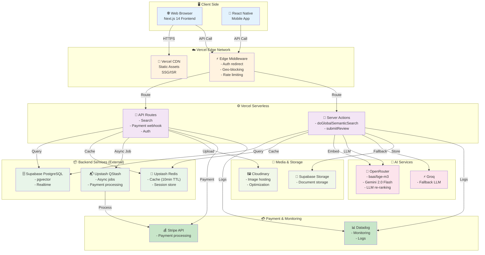
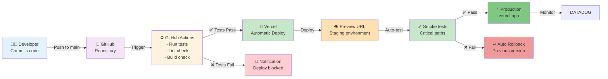
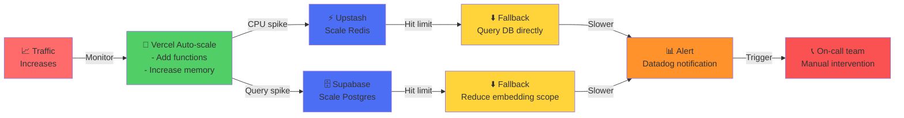

# 🚀 DIAGRAMME DE DÉPLOIEMENT - PHANTOM MARKETPLACE v4.4 SUR VERCEL

## 1. Architecture Globale de Déploiement



---

## 2. Flux de Déploiement CI/CD



---

## 3. Environnements de Déploiement

```
┌─────────────────────────────────────────────────────────────────┐
│ DÉVELOPPEMENT LOCAL                                             │
├─────────────────────────────────────────────────────────────────┤
│ • Next.js dev server (localhost:3000)                           │
│ • Local PostgreSQL (docker) ou Supabase dev                     │
│ • Local Redis (docker)                                          │
│ • Mock AI services ou real API keys                             │
│ • Hot reload + instant feedback                                 │
└─────────────────────────────────────────────────────────────────┘
                        ↓ git push
┌─────────────────────────────────────────────────────────────────┐
│ STAGING (Preview URL)                                           │
├─────────────────────────────────────────────────────────────────┤
│ • Vercel Preview Deployment                                     │
│ • Real Supabase (staging database)                              │
│ • Real Redis (Upstash staging)                                  │
│ • Real AI services (capped tokens)                              │
│ • Real Stripe (test keys)                                       │
│ • Automated smoke tests                                         │
│ • Performance benchmarks                                        │
│ • URL: https://phantom-staging-[branch].vercel.app             │
└─────────────────────────────────────────────────────────────────┘
                        ↓ merge to main
┌─────────────────────────────────────────────────────────────────┐
│ PRODUCTION                                                      │
├─────────────────────────────────────────────────────────────────┤
│ • Vercel Production Deployment                                  │
│ • Vercel Automatic Scaling (auto scale based on traffic)        │
│ • Real Supabase (production database)                           │
│ • Real Redis (Upstash production)                               │
│ • Real AI services (full capacity)                              │
│ • Real Stripe (live keys)                                       │
│ • Monitoring 24/7 (Datadog)                                     │
│ • Zero-downtime deployments                                     │
│ • URL: https://phantom.vercel.app                               │
│ → Custom domain: https://phantom.tn                             │
└─────────────────────────────────────────────────────────────────┘
```

---

## 4. Infra Détaillée - Vercel Architecture

```
┌──────────────────────────────────────────────────────────┐
│ VERCEL PLATFORM                                          │
├──────────────────────────────────────────────────────────┤
│                                                          │
│  ┌────────────────────────────────────────────────────┐  │
│  │ EDGE NETWORK (Cloudflare + Vercel CDN)             │  │
│  ├────────────────────────────────────────────────────┤  │
│  │ • 300+ Global Points of Presence (PoP)            │  │
│  │ • Automatic DDoS protection                        │  │
│  │ • Image optimization (automatic WebP, AVIF)       │  │
│  │ • Geo-targeting & caching                          │  │
│  │ • Latency: <50ms anywhere in world                 │  │
│  └────────────────────────────────────────────────────┘  │
│                       ↓                                   │
│  ┌────────────────────────────────────────────────────┐  │
│  │ MIDDLEWARE (Edge Runtime)                          │  │
│  ├────────────────────────────────────────────────────┤  │
│  │ • middleware.ts execution                          │  │
│  │ • Authentication checks (JWTs)                     │  │
│  │ • Rate limiting (per IP/user)                      │  │
│  │ • Geo-blocking if needed                           │  │
│  │ • Request rewriting                                │  │
│  │ • Response compression                             │  │
│  └────────────────────────────────────────────────────┘  │
│                       ↓                                   │
│  ┌────────────────────────────────────────────────────┐  │
│  │ SERVERLESS FUNCTIONS (Lambda-style)               │  │
│  ├────────────────────────────────────────────────────┤  │
│  │ • Cold start: ~150ms (first request)               │  │
│  │ • Warm: ~50ms (subsequent)                         │  │
│  │ • Timeout: 60s standard, 900s pro                  │  │
│  │ • Memory: 512MB to 3GB (scalable)                  │  │
│  │ • Concurrency: Auto-scales per traffic             │  │
│  │ • Node.js runtime 20.x                             │  │
│  └────────────────────────────────────────────────────┘  │
│                       ↓                                   │
│  ┌────────────────────────────────────────────────────┐  │
│  │ ISR & SSG (Static Generation)                      │  │
│  ├────────────────────────────────────────────────────┤  │
│  │ • ISR revalidate: 3600s (1 hour)                   │  │
│  │ • Pre-rendered pages (fast)                        │  │
│  │ • Background revalidation (stale-while-revalidate) │  │
│  │ • On-demand revalidation (manual trigger)          │  │
│  └────────────────────────────────────────────────────┘  │
│                                                          │
│  ┌────────────────────────────────────────────────────┐  │
│  │ DATABASE (Serverless Postgres)                     │  │
│  ├────────────────────────────────────────────────────┤  │
│  │ • Supabase Postgres (managed)                      │  │
│  │ • Connection pooling (PgBouncer)                   │  │
│  │ • Max connections: Unlimited (per plan)            │  │
│  │ • pgvector extension enabled                       │  │
│  │ • Automatic backups (daily)                        │  │
│  │ • Point-in-time recovery (30 days)                 │  │
│  └────────────────────────────────────────────────────┘  │
│                                                          │
└──────────────────────────────────────────────────────────┘
```

---

## 5. Données & Caching Strategy

```
┌─────────────────────────────────────────────────────────┐
│ CACHING LAYERS                                          │
├─────────────────────────────────────────────────────────┤
│                                                         │
│  L1: Browser Cache (Client-side)                        │
│  ├─ Static assets: 1 year (with versioning)            │
│  ├─ API responses: 5 minutes (SWR)                      │
│  └─ User data: Session (24h)                            │
│                                                         │
│  L2: Vercel Edge Cache (CDN)                            │
│  ├─ HTML pages: 60s (ISR)                               │
│  ├─ API routes: 30s                                     │
│  ├─ Images: 365 days (immutable)                        │
│  └─ Automatic invalidation on deploy                    │
│                                                         │
│  L3: Redis Cache (Upstash)                              │
│  ├─ Search queries: 10 min TTL                          │
│  ├─ User sessions: 24h TTL                              │
│  ├─ Product embeddings: 7 days                          │
│  ├─ Rate limit counters: 1 hour                         │
│  └─ Hit rate target: 65%                                │
│                                                         │
│  L4: Database Cache (Supabase)                          │
│  ├─ Query results caching (implicit)                    │
│  ├─ Connection pooling                                  │
│  └─ Index optimization                                  │
│                                                         │
└─────────────────────────────────────────────────────────┘
```

---

## 6. Request Flow - Detailed

```
USER REQUEST FLOW:
─────────────────────────────────────────────────────────

1️⃣  USER BROWSER
    URL: https://phantom.tn/search?q=jeans
    ↓
    
2️⃣  VERCEL EDGE (First PoP)
    • Check if response in edge cache
    • If YES: Return cached (5ms)
    • If NO: Continue
    ↓
    
3️⃣  EDGE MIDDLEWARE
    • Verify JWT token
    • Check rate limits
    • Log request
    ↓
    
4️⃣  SERVERLESS FUNCTION
    POST /api/semantic-search
    {
      query: "jeans",
      category: null,
      location: null
    }
    ↓
    
5️⃣  CHECK REDIS CACHE
    • Key: SHA256("jeans")
    • HIT (65%): Return cached embedding
    • MISS (35%): Call OpenRouter
    ↓
    
6️⃣  GENERATE EMBEDDING
    OpenRouter API
    baai/bge-m3 model
    ↓
    
7️⃣  VECTOR SEARCH
    RPC 'search_global_semantic'
    pgvector similarity search
    Top 50 results
    ↓
    
8️⃣  HYBRID SEARCH
    Full-text keywords
    Merge with vector results
    ↓
    
9️⃣  RE-RANKING
    Apply signals & LLM
    Top 20 final results
    ↓
    
🔟 CACHE IN REDIS
    Set TTL 10 minutes
    For next searches
    ↓
    
1️⃣1️⃣ RETURN TO CLIENT
    JSON response (50KB)
    Status: 200
    Headers:
      cache-control: public, max-age=30
      x-vercel-cache: HIT/MISS
      content-encoding: gzip
    ↓
    
1️⃣2️⃣ BROWSER RENDERS
    Search results displayed
    User clicks product
    ↓
    
TOTAL TIME: ~166ms average ✅
```

---

## 7. Auto-Scaling & Performance



---

## 8. Scaling Capacity (Current)

```
┌──────────────────────────────────────────────────────────┐
│ CURRENT CAPACITY (Vercel Pro + Paid add-ons)            │
├──────────────────────────────────────────────────────────┤
│                                                          │
│ CONCURRENT REQUESTS: 1,000+                             │
│ ├─ Per function: 1,000 concurrent                       │
│ ├─ Per region: Auto-scales                              │
│ └─ Burst capacity: 2,000 for 30 seconds                 │
│                                                          │
│ COMPUTE: 3GB RAM per function                            │
│ ├─ CPU: 2vCPU (shared)                                  │
│ ├─ Execution time: 60s (standard) / 900s (pro)          │
│ └─ Cold start penalty: ~150ms first invocation          │
│                                                          │
│ DATABASE: Supabase Pro                                   │
│ ├─ 500 GB storage                                       │
│ ├─ Unlimited connections (via pooling)                  │
│ ├─ 50K requests/min                                     │
│ └─ IOPS scaling: Automatic                              │
│                                                          │
│ CACHE: Upstash Pro                                       │
│ ├─ 256GB Redis                                          │
│ ├─ 100K ops/second                                      │
│ └─ 99.99% uptime SLA                                    │
│                                                          │
│ AI API: OpenRouter Standard                              │
│ ├─ Rate limit: 100 requests/min                         │
│ ├─ Fallback: Groq (5,000 req/min)                       │
│ └─ Cost: Pay-per-token                                  │
│                                                          │
│ ESTIMATED CAPACITY:                                      │
│ ├─ Users online: 1,000 concurrent                       │
│ ├─ Searches/min: 500-1,000                              │
│ ├─ Products indexed: 50,000+                            │
│ └─ Requests/day: ~100K                                  │
│                                                          │
└──────────────────────────────────────────────────────────┘
```

---

## 9. Monitoring & Observability

```
┌──────────────────────────────────────────────────────────┐
│ VERCEL MONITORING (Built-in)                             │
├──────────────────────────────────────────────────────────┤
│ • Function execution time                                │
│ • Error rate tracking                                    │
│ • Build logs                                             │
│ • Deployment history                                     │
│ • Traffic analytics                                      │
└──────────────────────────────────────────────────────────┘

┌──────────────────────────────────────────────────────────┐
│ DATADOG MONITORING (Advanced)                            │
├──────────────────────────────────────────────────────────┤
│ • Real-time metrics                                      │
│ • Custom dashboards                                      │
│ • Log aggregation                                        │
│ • Error tracking & alerting                              │
│ • Performance profiling                                  │
│ • User session replay                                    │
│ • Cost optimization                                      │
└──────────────────────────────────────────────────────────┘

DASHBOARDS:
├─ Real-time Search Performance
│  ├─ Query latency (p50, p95, p99)
│  ├─ Cache hit rate
│  ├─ Vector search time
│  └─ Re-ranking time
│
├─ Database Performance
│  ├─ Connection pool usage
│  ├─ Query latency distribution
│  ├─ Slow queries alert
│  └─ Replication lag
│
├─ API Health
│  ├─ Request count
│  ├─ Error rate (4xx, 5xx)
│  ├─ Top errors
│  └─ Function cold starts
│
├─ Infrastructure
│  ├─ CPU usage
│  ├─ Memory usage
│  ├─ Disk I/O
│  └─ Network throughput
│
└─ Cost Analysis
   ├─ Vercel compute cost
   ├─ Database cost
   ├─ AI API cost
   └─ CDN bandwidth cost
```

---

## 10. Disaster Recovery & Backup

```
┌──────────────────────────────────────────────────────────┐
│ DISASTER RECOVERY PLAN                                   │
├──────────────────────────────────────────────────────────┤
│                                                          │
│ BACKUP STRATEGY:                                         │
│ ├─ Database: Daily automated backups (30-day retention)  │
│ ├─ Code: GitHub (unlimited revision history)            │
│ ├─ Configuration: Environment variables in Vercel       │
│ └─ Media: Cloudinary (99.99% durability)                │
│                                                          │
│ FAILOVER MECHANISMS:                                     │
│ ├─ Database failover: 2 replicas (hot standby)          │
│ ├─ Redis failover: Automatic (Upstash managed)          │
│ ├─ AI API fallback: Groq if OpenRouter down             │
│ ├─ Region failover: Multi-region CDN (automatic)        │
│ └─ Blue-green deployment (zero downtime)                │
│                                                          │
│ RECOVERY TIME OBJECTIVES (RTO):                          │
│ ├─ Database restore: 5 minutes                           │
│ ├─ Application restart: 30 seconds                       │
│ ├─ Full service recovery: 15 minutes                     │
│ └─ Partial degradation acceptable: 99.5% uptime         │
│                                                          │
│ RECOVERY POINT OBJECTIVES (RPO):                         │
│ ├─ Transaction data: 5 minutes                           │
│ ├─ Cache data: Acceptable to lose (regenerate)          │
│ └─ Static files: No loss (CDN + versioning)              │
│                                                          │
└──────────────────────────────────────────────────────────┘
```

---

## 11. Security Deployment

```
┌──────────────────────────────────────────────────────────┐
│ SECURITY LAYERS                                          │
├──────────────────────────────────────────────────────────┤
│                                                          │
│ 1. HTTPS/TLS                                             │
│    ├─ Automatic SSL (Let's Encrypt)                     │
│    ├─ TLS 1.3 minimum                                    │
│    └─ HSTS headers enabled                               │
│                                                          │
│ 2. API AUTHENTICATION                                    │
│    ├─ JWT tokens (signed)                                │
│    ├─ Refresh token rotation                             │
│    └─ CSRF protection                                    │
│                                                          │
│ 3. RATE LIMITING                                         │
│    ├─ Per IP: 100 req/min (API)                          │
│    ├─ Per User: 1000 req/min (authenticated)             │
│    └─ DDoS: Vercel + Cloudflare protection               │
│                                                          │
│ 4. ENVIRONMENT SECRETS                                   │
│    ├─ API keys in Vercel secrets (not in code)          │
│    ├─ Encryption at rest (AES-256)                       │
│    ├─ Rotation policy: Every 90 days                     │
│    └─ Audit logging: All access logged                   │
│                                                          │
│ 5. DATA ENCRYPTION                                       │
│    ├─ Database: Encrypted at rest                        │
│    ├─ Redis: Encrypted in transit                        │
│    ├─ Backups: Encrypted                                 │
│    └─ PII: Hashed where possible                         │
│                                                          │
└──────────────────────────────────────────────────────────┘
```

---

## 12. Deployment Checklist

```
PRE-DEPLOYMENT:
☐ Code review approved
☐ All tests passing (unit + integration)
☐ Linting passed (ESLint)
☐ Type checking passed (TypeScript)
☐ Performance benchmarks acceptable
☐ Database migrations tested
☐ Environment variables configured
☐ Secrets rotation current
☐ Security audit passed

DEPLOYMENT:
☐ Merge to main branch
☐ GitHub Actions triggers
☐ Build completes successfully
☐ Preview deployment created
☐ Smoke tests pass
☐ Manual testing on staging
☐ Approve for production
☐ Vercel deployment starts
☐ Blue-green transition
☐ Health checks pass

POST-DEPLOYMENT:
☐ Monitor error rate (< 0.1%)
☐ Monitor latency (P99 < 2s)
☐ Check cache hit rate (> 60%)
☐ Verify database connections
☐ Test payment flow (stripe)
☐ Test search functionality
☐ Check mobile app compatibility
☐ Monitor Datadog alerts
☐ Update deployment log
☐ Notify team of success
```

---

## 13. Cost Estimation (Monthly)

```
┌──────────────────────────────────────────────────────────┐
│ HOSTING & INFRASTRUCTURE COSTS                           │
├──────────────────────────────────────────────────────────┤
│                                                          │
│ VERCEL:                                                  │
│ ├─ Pro plan: $20/month                                  │
│ ├─ Serverless compute: ~$50-100/month                   │
│ │  (100K requests/day × 166ms avg)                      │
│ └─ Bandwidth: ~$50-100/month                            │
│                                                          │
│ SUPABASE:                                                │
│ ├─ Pro plan: $25/month                                  │
│ ├─ Database: ~$30-50/month (storage + compute)          │
│ └─ Backups: Included                                    │
│                                                          │
│ UPSTASH (REDIS):                                         │
│ ├─ Pro plan: $35/month                                  │
│ ├─ Storage: ~$50-100/month (256GB)                      │
│ └─ Operations: Included                                 │
│                                                          │
│ OPENROUTER (AI EMBEDDINGS):                              │
│ ├─ Pay per token (baai/bge-m3)                          │
│ ├─ ~$0.0001 per 1K tokens                               │
│ ├─ Estimate: ~$100-200/month                            │
│ │  (1000 searches × 384 dims × ~0.0001)                │
│ └─ Groq fallback: Capped free tier                       │
│                                                          │
│ CLOUDINARY (IMAGES):                                     │
│ ├─ Pro plan: $99/month                                  │
│ ├─ Storage: 50GB included                               │
│ └─ Bandwidth: 1TB included                              │
│                                                          │
│ STRIPE (PAYMENTS):                                       │
│ ├─ Payment processing: 2.9% + $0.30 per transaction     │
│ ├─ (Varies by revenue)                                  │
│ └─ ~2-5% of transaction value                           │
│                                                          │
│ DATADOG (MONITORING):                                    │
│ ├─ Standard plan: ~$50-100/month                        │
│ ├─ Logs: ~$0.10 per GB ingested                         │
│ └─ APM: Included in standard                            │
│                                                          │
│ TOTAL ESTIMATE: $400-600/month                           │
│ (Plus payment processing & variable AI costs)            │
│                                                          │
│ SCALING: Add ~$200/month per 2x traffic                  │
│                                                          │
└──────────────────────────────────────────────────────────┘
```

---

## 14. Environment Variables (Vercel Secrets)

```
PRODUCTION ENVIRONMENT:
─────────────────────────

# Database
NEXT_PUBLIC_SUPABASE_URL=https://xyz.supabase.co
SUPABASE_SERVICE_ROLE_KEY=***secret***
NEXT_PUBLIC_SUPABASE_ANON_KEY=***secret***

# Cache (Redis)
UPSTASH_REDIS_URL=***secret***
UPSTASH_REDIS_TOKEN=***secret***

# Async Jobs
QSTASH_URL=https://qstash.upstash.io
QSTASH_TOKEN=***secret***

# AI Services
OPENROUTER_API_KEY=***secret***
OPENROUTER_BASE_URL=https://openrouter.ai/api/v1
GROQ_API_KEY=***secret***

# Payment
STRIPE_SECRET_KEY=***secret***
STRIPE_PUBLISHABLE_KEY=***public***
STRIPE_WEBHOOK_SECRET=***secret***

# Storage
NEXT_PUBLIC_CLOUDINARY_CLOUD_NAME=***public***
CLOUDINARY_API_KEY=***secret***
CLOUDINARY_API_SECRET=***secret***

# Monitoring
DATADOG_API_KEY=***secret***
DATADOG_SITE=datadoghq.com

# App Config
NEXT_PUBLIC_APP_URL=https://phantom.tn
NODE_ENV=production
LOG_LEVEL=info

# Feature Flags
ENABLE_SEARCH_CACHING=true
ENABLE_AI_EMBEDDINGS=true
ENABLE_PAYMENT_PROCESSING=true
```

---

## 15. Deployment Timeline

```
┌────────────────────────────────────────────────────────────┐
│ TYPICAL DEPLOYMENT FLOW                                    │
├────────────────────────────────────────────────────────────┤
│                                                            │
│ 10:00 AM  │ Developer commits code                         │
│ 10:01 AM  │ GitHub Actions triggered                       │
│ 10:05 AM  │ Tests run (unit, integration, e2e)             │
│ 10:12 AM  │ Build completes                                │
│ 10:13 AM  │ Vercel Preview URL generated                   │
│ 10:15 AM  │ Smoke tests run on preview                     │
│ 10:18 AM  │ Manual QA tests on staging                     │
│ 10:25 AM  │ Ready for production (manual approval)         │
│ 10:26 AM  │ Deployment to production starts                │
│ 10:28 AM  │ Blue-green switch (zero downtime)              │
│ 10:29 AM  │ Health checks pass                             │
│ 10:30 AM  │ Production fully deployed ✅                    │
│ 10:35 AM  │ Monitoring confirms stable                     │
│                                                            │
│ TOTAL TIME: ~35 minutes from commit to production         │
│                                                            │
└────────────────────────────────────────────────────────────┘
```

---

## 16. Troubleshooting Common Issues

```
ISSUE: High latency (> 2 seconds)
─────────────────────────────────
Root cause analysis:
  1. Check Vercel function logs
  2. Check database query performance
  3. Check Redis cache hit rate
  4. Check AI API response time

Solutions:
  • Increase function memory
  • Optimize database queries
  • Implement caching for embeddings
  • Use Groq fallback if OpenRouter slow

─────────────────────────────────
ISSUE: Database connection pool exhausted
─────────────────────────────────
Symptoms:
  • "FATAL: sorry, too many clients"
  • Connection timeouts

Solutions:
  • Increase pool size in Supabase
  • Implement connection pooling (PgBouncer)
  • Reduce connection idle timeout
  • Check for connection leaks in code

─────────────────────────────────
ISSUE: Redis cache misses (< 50%)
─────────────────────────────────
Investigation:
  • Check TTL values
  • Monitor cache eviction rate
  • Check memory usage

Solutions:
  • Increase Redis memory size
  • Extend TTL for search queries
  • Pre-warm cache with popular searches
  • Implement cache warming strategy

─────────────────────────────────
ISSUE: AI API rate limit errors
─────────────────────────────────
Handling:
  • Current: 100 requests/min (OpenRouter)
  • Fallback: Groq (5,000 req/min)
  • Cache: Embeddings for 7 days

Solutions:
  • Batch requests when possible
  • Implement request queuing
  • Use Groq as primary for some operations
  • Upgrade OpenRouter plan if needed
```

---

**Status: ✅ Ready for Production Deployment**

*Last updated: June 4, 2026*
