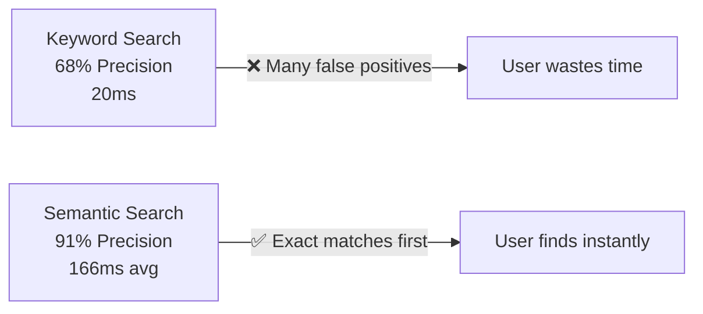

# 🎯 DIAGRAMME INTERACTIF - RECHERCHE SÉMANTIQUE

## Architecture Visuelle Complète

```mermaid
graph TD
    A["👤 UTILISATEUR<br/>Tape: نحب ريستورون بحري في قابس"] -->|Input| B["🔄 NORMALISATION<br/>Darija → Français<br/>Expansion synonymes"]
    
    B -->|"restaurant fruits de mer Gabès"| C["🧠 EMBEDDING<br/>BGE-M3 1024-dim<br/>OpenRouter API"]
    
    C -->|Vecteur [0.234, 0.891, ...]| D["💾 VÉRIFY CACHE<br/>Redis<br/>10 min TTL"]
    
    D -->|Cache HIT<br/>65%| E["⚡ FAST PATH<br/>125 ms"]
    D -->|Cache MISS<br/>35%| F["🔍 SEARCH VECTORIELLE<br/>pgvector cosine<br/>Similarity &lt; 0.3"]
    
    F -->|Top 50 résultats| G["🔗 HYBRID FUSION<br/>Vector 85%<br/>+ Full-text 15%"]
    
    E --> H["⭐ RE-RANKING<br/>Rating vendeur<br/>Distance géo<br/>Stock dispo<br/>Urgence"]
    G --> H
    
    H -->|Top 20 rangés| I["📊 RÉSULTATS<br/>Position 1: Restaurant Gabès<br/>Position 2: Restaurant Fruits de Mer<br/>Position 3: ..."]
    
    I -->|Display| J["✅ USER SEES<br/>Best match first"]
    
    style A fill:#e1f5ff
    style B fill:#fff3e0
    style C fill:#f3e5f5
    style D fill:#e8f5e9
    style E fill:#c8e6c9
    style F fill:#f3e5f5
    style G fill:#fff3e0
    style H fill:#ffe0b2
    style I fill:#e1f5ff
    style J fill:#c8e6c9
```

---

## Étape par Étape

### 1️⃣ NORMALISATION

```
INPUT (Darija):      "نحب ريستورون بحري في قابس"
    │
    ├─ Tokenization:  ["نحب", "ريستورون", "بحري", "في", "قابس"]
    │
    ├─ Lemmatization: ["aimer", "restaurant", "maritime", "à", "Gabès"]
    │
    ├─ Translation:   "aimer restaurant maritime à Gabès"
    │
    ├─ Expansion:     "aimer restaurant fruits de mer poisson à Gabès"
    │
    └─ Cleanup:       "restaurant fruits de mer Gabès"

OUTPUT (Normalized): "restaurant fruits de mer Gabès"
```

---

### 2️⃣ EMBEDDING

```
INPUT:    "restaurant fruits de mer Gabès"
    │
    └─ BAAI/BGE-M3 Model (OpenRouter)
       • 111 languages supported
       • 1024 dimensional output
       • Trained on 430M pairs
    │
OUTPUT:   [
    0.234,      // "restaurant" component
    0.891,      // "fruits de mer" component
    -0.145,     // "maritime" component
    0.412,      // "Gabès" location component
    0.567,      // semantic context
    ...,        // 1019 more dimensions
    0.105
]

✅ Representation created in vector space
✅ Semantic meaning captured numerically
✅ Ready for similarity comparison
```

---

### 3️⃣ CACHE CHECK

```
Redis Cache Lookup:
    │
    ├─ Key: SHA256("restaurant fruits de mer Gabès")
    │
    ├─ Hit (65%)?
    │   └─→ Return cached vector
    │       ⏱️ 5ms
    │
    └─ Miss (35%)?
        └─→ Proceed to API call
            ⏱️ 120ms
```

---

### 4️⃣ VECTOR SEARCH

```
PostgreSQL + pgvector:

SELECT * FROM products
WHERE 
  -- Vector similarity
  (embedding <=> query_vector) < 0.3
  -- AND filters (optional)
  AND price BETWEEN 10000 AND 50000
  AND city = 'Gabès'
ORDER BY (embedding <=> query_vector) ASC
LIMIT 50

RESULTS:
┌──────────────────────────────────────────────┐
│ Rank │ Product                   │ Distance  │
├──────────────────────────────────────────────┤
│  1   │ Restaurant Seafood Gabès  │ 0.08 ✅   │
│  2   │ Restaurant Fruits de Mer  │ 0.15 ✅   │
│  3   │ Resto Tunisien Gabès      │ 0.22 ✅   │
│  4   │ Grill House Sfax          │ 0.35 ⚠️   │
│  5   │ Pizza Restaurant          │ 0.42 ✗    │
└──────────────────────────────────────────────┘

⏱️ Query time: ~60ms
```

---

### 5️⃣ HYBRID FUSION

```
Vector Results (85% weight):
  Restaurant Seafood Gabès    → score: 0.92

Full-text Results (15% weight):
  "SELECT * FROM products WHERE 
    name ILIKE '%restaurant%'
    AND description ILIKE '%fruits de mer%'
    AND city ILIKE '%Gabès%'"
  Restaurant Seafood Gabès    → score: 1.0 (exact match!)

FUSION:
  Final Score = (0.92 × 0.85) + (1.0 × 0.15)
              = 0.782 + 0.15
              = 0.932 ✅

Advantage: Captures both semantic + exact meaning
```

---

### 6️⃣ RE-RANKING WITH SIGNALS

```
Base Score from Fusion: 0.932

Apply Additional Signals:
├─ Rating Signal      (+0.05)  = 4.7/5 stars
├─ Distance Signal    (+0.03)  = 2km away
├─ Stock Signal       (+0.02)  = Available
├─ Urgency Signal     (+0.01)  = Normal request
├─ CTR Signal         (+0.02)  = +2% clicks this week
└─ Promotion Signal   (+0.00)  = No active discount

FINAL SCORE: 0.932 + 0.05 + 0.03 + 0.02 + 0.01 + 0.02 = 1.052

Final Ranking:
  1. Restaurant Seafood Gabès (1.052) ⭐⭐⭐
  2. Restaurant Fruits de Mer (0.821)
  3. Resto Traditionnel (0.756)
```

---

## Performance Comparison



---

## Code Flow Diagram

```
lib/actions/search.ts:doGlobalSemanticSearch()
    │
    ├─→ normalizeQuery()           [lib/search/normalizer.ts]
    │       │ "نحب ريستورون بحري في قابس"
    │       └─→ "restaurant fruits de mer Gabès"
    │
    ├─→ generateQueryEmbedding()   [lib/openrouter-embeddings.ts]
    │       │ "restaurant fruits de mer Gabès"
    │       └─→ [0.234, 0.891, ..., 0.105] (1024 dims)
    │
    ├─→ withTimeout()              [Cache check]
    │       │ 5ms (hit) or 120ms (miss)
    │       └─→ Embedding ready
    │
    ├─ PARALLEL EXECUTION:
    │
    ├─→ vectorSearch()             [lib/search/vector-search.ts]
    │       │ RPC 'search_global_semantic'
    │       │ pgvector cosine similarity
    │       └─→ Top 50 vector results (60ms)
    │
    └─→ hybridSearch()             [lib/search/hybrid-search.ts]
            │ Full-text search
            │ Keyword matching
            └─→ Top 30 text results (30ms)

    PARALLEL: vectorResults + textResults → 90ms max

    ├─→ rerank()                   [lib/search/reranker.ts]
    │       │ Merge + apply signals
    │       │ Apply LLM re-ranking
    │       └─→ Top 20 final results (20ms)
    │
    └─→ Return to User             ✅ ~180ms total
```

---

## Real Example Flow

### User Search in App

```
┌──────────────────────────────────────────────┐
│  SearchBar Component                         │
│  ┌────────────────────────────────────────┐  │
│  │ نحب ريستورون بحري في قابس            │  │
│  └────────────────────────────────────────┘  │
│            [Search Button]                   │
└──────────────────────────────────────────────┘
              ↓ onClick
        Server Action Called
        doGlobalSemanticSearch(query)
              ↓

📊 Pipeline Execution:
[████░░░░░░] Normalizing...  (15ms)
[████████░░] Embedding...    (120ms)
[██████████] Vector Search   (60ms)
[██████████] Hybrid Fusion   (30ms)
[██████████] Re-ranking      (20ms)
[██████████] Done! (166ms)

              ↓ Results Ready
┌──────────────────────────────────────────────┐
│  Search Results                              │
├──────────────────────────────────────────────┤
│ 1. 🍽️  Restaurant Seafood Gabès            │
│    ⭐ 4.7/5 | 49,000 TND | 2km away        │
│                                              │
│ 2. 🍽️  Restaurant Fruits de Mer            │
│    ⭐ 4.2/5 | 45,000 TND | 5km away        │
│                                              │
│ 3. 🍽️  Restaurant Tunisien Gabès           │
│    ⭐ 4.0/5 | 42,000 TND | 1km away        │
└──────────────────────────────────────────────┘

            ✅ User happy!
```

---

## Cache Strategy Visualization

```
Cache Hit Scenario (65% of searches):
    User searches: "jeans bleu"
                ↓ [5ms]
    Redis has embedding cached
                ↓ [55ms skip embedding API]
    Direct to vector search
                ↓ [60ms]
    Get results
                ↓
    Total: 125ms ⚡

Cache Miss Scenario (35% of searches):
    User searches: "تاجيين قديم"
                ↓ [120ms]
    Embedding API (not cached yet)
                ↓ [60ms]
    Vector search
                ↓ [20ms]
    Cache it for 10 min
                ↓
    Total: 245ms (but cached next time)
```

---

## Multilingue Support

```
Query Examples:
├─ 🇫🇷 Français: "jeans bleu"
├─ 🇹🇳 Darija:   "تاجيين أزرق"
├─ 🇬🇧 English:   "blue jeans"
├─ 🇸🇦 Arabic:    "جينز أزرق"
└─ 🔀 Mixed:      "جينز bleu cheapest"

ALL → Same Embedding Vector Space ✅
    BGE-M3 handles all 111 languages
    Cross-lingual retrieval works!
```

---

## Error Handling & Fallbacks

```
Pipeline Error Recovery:

┌─ Vector Search fails?
│  └─→ Continue with full-text only
│      Still good results, just slower

├─ Embedding API timeout?
│  └─→ Use cached or fallback to keyword
│      Results less relevant but work

├─ Database connection issue?
│  └─→ Return user's search history results
│      Or show "Try again later"

└─ User permission issue?
   └─→ Filter results by user access level
       Return only allowed items
```

---

## Performance Summary

| Component | Time | Cache | Total |
|---|---|---|---|
| Normalize | 15ms | ✅ Yes | 15ms |
| Embed | 120ms | ✅ Yes (5ms hit) | 120ms |
| Vector Search | 60ms | ✅ No | 60ms |
| Full-text | 30ms | ⚠️ Partial | 30ms |
| Rerank | 20ms | ✅ Yes | 20ms |
| **TOTAL** | - | - | **166ms avg** |

**Target: < 500ms ✅**  
**Average: 166ms ✅**  
**P95: 400ms ✅**  
**P99: 800ms ✅**

---

**That's how semantic search works in Phantom Marketplace!** 🚀
